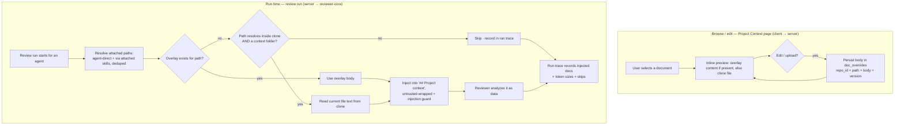

# Spec: Project Context Folder

**Spec ID:** SPEC-2026-07-02-project-context-folder
**Status:** draft
**Date:** 2026-07-02
**Revised:** 2026-07-03 — **v2: full design-mock parity.** Adds the two-panel master-detail layout (document list + inline rendered preview), in-browser **view + edit** and **upload** of context documents via a **DB-shadow overlay** (the clone stays read-only), and a **coverage ring**. This supersedes v1's view-only / no-editing / "coverage-ring-replaced-by-count" decisions. AC-1…AC-21 are unchanged (append-only); v2 adds AC-22…AC-31.
**Affects:** full-stack (client · server · reviewer-core prompt assembly)
**Supersedes:** —

## 1. Problem & Motivation

Repositories already contain human-authored markdown — specs, design docs, incident write-ups — that encodes the rules a change is supposed to respect. Today those documents only inform people; the review agents never see them, so a reviewer cannot flag a change that violates a project's own stated invariant. This feature lets a user browse, curate, and **attach** the repo's markdown documents to a review agent or skill, so that at review time the document's text is injected into the reviewer's prompt as context. A spec stops being a "for humans" document and starts steering the reviewer. Because a repo's own files are not always the ideal reviewer context, the user can also **edit** a document or **add** a new one; those edits live in a database overlay (never in the read-only clone) and become the text the reviewer sees.

## 2. Goals / Non-goals

**Goals:**

- Surface every markdown document under the repo's configured root context folders (default `specs`, `docs`, `insights`; the set of root folder names is configurable), at any nesting depth, on a Project Context page, each with its repo-relative path.
- Present the page as a **two-panel master-detail**: a document list on the left, an **inline rendered preview** of the selected document on the right (replacing the v1 modal preview).
- Let a user **view and edit** a document's content in the browser, and **upload/create** new context documents — persisted in a **database overlay** (`doc_overrides`), never written to the repo clone or git remote.
- Provide a document **toolbar** (add `+` · upload · refresh) on the Project Context page, and keep the document list **auto-updating** — a newly added, uploaded, or edited document appears immediately without a manual page reload.
- Let a user attach/detach those documents to an **agent** (Context tab of the agent editor) and to a **skill** ("Project context to use" section of the skill editor), storing each attachment as the document's **path** — never a copy of its text.
- Show a deterministic **token count** per document, an **"used by N agents"** count, and a **coverage ring** (percentage of the workspace's agents that use the document).
- At review time, read each attached document — **overlay content when present, otherwise the clone file** — and inject it into the reviewer's existing `## Project context` prompt slot, wrapped as untrusted data.
- Surface, in the run trace's Prompt Assembly view, which documents were injected (with token sizes) and the exact injected text, plus any documents that were skipped.
- Let a user edit the repository's set of root context-folder names on the Project Context page (default `specs` / `docs` / `insights`).

**Non-goals:**

- **Automatic per-PR selection of relevant documents** (a "flash-selector") — future work; manual attach is sufficient now.
- **A dedicated spec-conformance agent that blocks merges** — planned for a later lesson (L06); here the reviewer only *reads* the context.
- **Writing edits/uploads back to the repo clone or the git remote (commits / PRs).** Editing persists ONLY in the DB overlay; the clone remains a strictly read-only mirror of the remote (§7). Reflecting overlay edits back into the actual repository via git is explicitly out of scope.
- **Automatic truncation or token-budget enforcement** across attached documents — the token counts are shown so the user can manage prompt size manually; no automatic trimming in this feature.

## 3. User Stories

- As a user, I can see all markdown documents of the project (any `.md` under the configured root context folders, any depth), with their paths, on the Project Context page.
- As a user, I can select a document and read its rendered content inline in a side panel, then switch to an edit mode to change it.
- As a user, I can edit a document or add a new one, and my changes persist (surviving repo resync) without altering the actual repository.
- As a user, I can attach documents to an agent (Context tab) and to a skill ("Project context to use" section), so the reviewer uses them as context.
- As a user, I see a token count, a "used by N agents" count, and a coverage ring per document, so I understand each document's size and reach.
- As a user, when a review runs, the attached documents (overlay content when edited, else the clone file) are injected as text into the agent's prompt.
- As a user, in the run trace / Prompt Assembly view I see which documents were injected (with their token sizes) and can open the full text that was actually added to that request.

## 4. Workflow & Module Communication

## 5. Acceptance Criteria (EARS)

- **AC-1** (Event-driven): WHEN a user opens the Project Context page for a repository, the system SHALL list every `.md` document located under the repository's configured root context folders, at any nesting depth, each shown with its repository-relative path.
- **AC-2** (Optional feature): WHERE a repository defines a custom set of root context-folder names, the system SHALL restrict discovery to those folders; absent a custom set, the system SHALL default to `specs`, `docs`, and `insights`.
- **AC-3** (Ubiquitous): The system SHALL perform document discovery, token counting, coverage computation, and prompt injection with zero LLM calls.
- **AC-4** (Event-driven): WHEN the system lists a context document, the system SHALL display a token count for that document computed by the existing deterministic tokenizer from the document's current content.
- **AC-5** (Event-driven): WHEN the system lists a context document, the system SHALL display the number of distinct agents that would receive it at review time — counting agents that attach it directly and agents whose attached skills include it.
- **AC-6** (Event-driven): WHEN a user opens the agent editor's Context tab or the skill editor's "Project context to use" section, the system SHALL present the repository's context documents as individually selectable items, each showing its path, root-folder category badge, token count, and a preview control, together with a name/path filter.
- **AC-7** (Event-driven): WHEN a user attaches or detaches a document in an editor, the system SHALL persist the change as the document's repository-relative path in that agent's or skill's metadata, and SHALL NOT store a copy of the document's text.
- **AC-8** (Ubiquitous): The system SHALL provide, on the Project Context page, browsing, inline preview/edit, upload, token count, used-by count, coverage, and root context-folder configuration; it SHALL NOT provide document attach/detach controls there — attach/detach lives only in the agent and skill editors.
- **AC-9** (Event-driven): WHEN the set of attached documents changes in an editor, the system SHALL update a live serialization preview showing how the attached set will appear in the prompt.
- **AC-10** (Event-driven): WHEN a review run executes for an agent, the system SHALL read each attached document — resolved from the agent directly and from the agent's attached skills — fresh from the repository's local clone by its stored path, and inject the resulting text into the prompt's existing `## Project context` slot.
- **AC-11** (Ubiquitous): The system SHALL wrap every injected context document in the shared untrusted-content delimiters and subject it to the shared injection guard, so injected document text is treated as data and never as instructions.
- **AC-12** (Unwanted behavior): IF an attached document's stored path does not resolve to an existing file in the clone at run time, THEN the system SHALL skip that document, complete the run normally, and record the skip (with the path) in the run trace.
- **AC-13** (Unwanted behavior): IF an attached document's stored path resolves outside the repository clone root or outside the configured root context folders, THEN the system SHALL skip it, record the skip, and SHALL NOT read the file.
- **AC-14** (Event-driven): WHEN the same document path is attached both directly to an agent and through one of that agent's attached skills, the system SHALL inject that document exactly once for the run.
- **AC-15** (Event-driven): WHEN a review run completes, the system SHALL record, in the run's Prompt Assembly trace, each injected document with its path and token size, and SHALL make the full injected text of that run openable.
- **AC-16** (Event-driven): WHEN a run skips one or more attached documents, the system SHALL list each skipped document with its path and skip reason in the run trace.
- **AC-17** (Event-driven): WHILE a document is shown in preview mode, the system SHALL render its content read-only; edit is a distinct mode (AC-23).
- **AC-18** (Unwanted behavior): IF no `.md` documents exist under the configured root context folders, THEN the system SHALL display an empty state rather than an error or a blank view.
- **AC-19** (Event-driven — acceptance scenario): WHEN an agent whose attached documents include a stated repository invariant (e.g., "api/ module must not import db/ directly") reviews a PR that violates that invariant, the system SHALL surface a finding that cites the attached document as its context — verify: eval / integration review scenario. (The deterministic precondition — that the invariant text is present in that run's `## Project context` slot — is guaranteed by AC-10 and AC-11.)
- **AC-20** (Event-driven): WHEN a user reorders the attached documents within an editor (via the drag handle), the system SHALL persist the new order and SHALL inject the documents in that order at run time.
- **AC-21** (Event-driven): WHEN a user edits the repository's set of root context-folder names on the Project Context page, the system SHALL persist the updated set and apply it to all subsequent document discovery (per AC-1 and AC-2).

<!-- ── v2 additions ── -->

- **AC-22** (Event-driven): WHEN a user selects a document on the Project Context page, the system SHALL render its content inline in a right-hand detail panel (a two-panel master-detail layout), not in a modal.
- **AC-23** (Event-driven): WHERE a document is selected, the system SHALL offer a Preview mode (rendered, read-only) and an Edit mode (editable text); switching to Edit SHALL show the document's current effective content (overlay if present, else clone file).
- **AC-24** (Event-driven): WHEN a user saves an edit, the system SHALL persist the new content as a database overlay row keyed by repository + repository-relative path (creating or updating it), and SHALL NOT write to the repository clone or the git remote.
- **AC-25** (State-driven): WHILE a document has a saved overlay, the system SHALL use the overlay content — not the clone file — for its inline preview, token count, and run-time injection.
- **AC-26** (Event-driven): WHEN the repository clone is resynced (fetch + hard reset), the system SHALL preserve all document overlays (they live in the database, not the clone) and continue serving overlay content.
- **AC-27** (Event-driven): WHEN a user uploads or creates a new document under a configured root folder, the system SHALL store it as an overlay-only document (no clone file), and that document SHALL appear in discovery (AC-1), be previewable/editable, and be attachable like any other.
- **AC-28** (Event-driven): WHEN the system shows a context document, the system SHALL display a coverage percentage computed deterministically as (distinct agents using the document ÷ total agents in the workspace) × 100, rendered `0` when the workspace has no agents.
- **AC-29** (Ubiquitous): The system SHALL show, in the document detail, BOTH the absolute "used by N agents" count (AC-5) and the coverage ring (AC-28) as distinct indicators.
- **AC-30** (Ubiquitous): The system SHALL treat overlay (edited/uploaded) document content as untrusted input — identical delimiter-wrapping and injection-guard handling as clone-file content (AC-11).
- **AC-31** (Unwanted behavior): IF an attached document has neither an overlay nor a resolvable clone file at run time, THEN the system SHALL skip it and record the skip (path + reason) in the run trace, and the run SHALL complete normally.
- **AC-32** (Event-driven): WHEN a user uses the Project Context page's document toolbar, the system SHALL provide controls to **add a new document**, **upload a markdown file**, and **refresh** the list; added/uploaded documents are stored as overlay-only docs (per AC-27) under a configured root folder.
- **AC-33** (Event-driven): WHEN a document is added, uploaded, edited, deleted, or the folder configuration changes, the system SHALL refresh the document list **automatically** (no manual page reload) so the change is immediately reflected.
- **AC-34** (Event-driven): WHEN a user deletes a document's overlay, the system SHALL remove the `doc_overrides` row; IF a clone file exists at that path, the document SHALL revert to serving the clone content; otherwise (overlay-only) the document SHALL disappear from discovery and any attachments referencing it SHALL skip at run time (AC-31). The system SHALL NOT delete clone files (they are the repository's real files; the clone is read-only).
- **AC-35** (Ubiquitous): The skill editor SHALL expose its "Project context to use" attachment UI in a dedicated **Context** tab (in the tab row Config / Context / Preview / Evals / Stats / Versions), matching the agent editor's Context tab and the design mock — not embedded inside the Config tab.
- **AC-36** (Optional feature): WHERE a repository has no readable clone (null / stale / missing clone path), the system SHALL STILL discover, list, preview, edit, attach, and inject its **overlay** documents (uploads/edits) — so the Context interface is usable for any selected repository regardless of clone availability. Clone-file discovery simply yields nothing extra in that case; discovery is `clone files (if any) ∪ overlay docs`, never an early empty return that hides overlays.

## 6. Edge Cases

| Case | Expected behavior | Covered by |
|---|---|---|
| Attached document was deleted from the repo before the run, no overlay | Skipped; run completes; skip recorded in trace | AC-12, AC-31 |
| Attached document has an overlay but the clone file was deleted | Overlay content is used; injected normally | AC-25 |
| Stored path escapes the clone root or the configured folders (e.g., `../../secret`) | Skipped, recorded, file never read | AC-13 |
| Same document attached both directly and via a skill | Injected exactly once | AC-14 |
| Document is empty / whitespace-only (clone or overlay) | Listed with a 0 token count; contributes an empty section at run time (no error) | AC-4, AC-10 |
| Overlay-only document (uploaded, no clone file) | Discovered, previewable, editable, attachable; injected from overlay | AC-27, AC-25 |
| Repository has no markdown under the configured folders and no overlays | Empty state shown | AC-18 |
| Document attached to a skill that no agent uses | Used-by count is 0; coverage 0%; still injected for any future agent that adopts the skill | AC-5, AC-28 |
| Workspace has zero agents | Coverage renders `0`, no divide-by-zero | AC-28 |
| A configured root folder does not exist in the clone but has overlay docs | Overlay docs under it are still discovered | AC-27, AC-21 |
| Two saves race on the same document | Last write wins; overlay stores the latest body + bumped version | AC-24 |

## 7. Non-functional

- **Determinism (security & cost):** The entire feature — discovery, token counting, coverage, and injection — SHALL make zero LLM calls (restates AC-3; verify: run-trace token accounting shows no model call attributable to context assembly).
- **Clone stays read-only:** the repository is checked out to a single shared working-tree clone that the sync process hard-resets to the remote on every poll/manual resync. The system SHALL NOT write to that clone; all user edits/uploads persist in the `doc_overrides` database table (read path prefers the overlay, falls back to the clone file). This is why editing is overlay-backed rather than a clone write — verify: after an edit + a repo resync, the edited content is still served (AC-26).
- **Workspace isolation:** WHEN the API serves a document list, content/preview, token count, used-by count, coverage, an edit/upload, or an overlay read, the system SHALL enforce the same workspace scoping as existing repository endpoints — verify: a cross-workspace request returns not-found, not the data.
- **Page performance:** WHEN the Project Context page loads, the system SHALL render the document list within 500 ms (p95) — verify: browser performance trace.
- **Accessibility:** New UI (Project Context two-panel page incl. the editor, editor Context tab) SHALL meet WCAG 2.1 AA — verify: axe scan.

## 8. Inputs (Provenance)

| Input | Provenance |
|---|---|
| List of markdown documents and their paths (clone files ∪ overlay docs) | [deterministic: repo-intel] (clone scan) + [new: DB overlay] (no LLM) |
| Configured root context-folder names (default `specs`/`docs`/`insights`) | [deterministic: repo-intel] (configuration, not model-derived) |
| Effective document content (overlay if present, else clone) injected at run time | [deterministic: repo-intel] (clone read) / [new: DB overlay] (edited body; no LLM) |
| Per-document token count | [deterministic: repo-intel] (existing tokenizer adapter, over effective content) |
| Used-by-agents count | [deterministic: repo-intel] (agent/skill attachment metadata) |
| Coverage percentage | [deterministic: repo-intel] (used-by ÷ workspace agent count) |
| The `## Project context` prompt slot, untrusted delimiter wrapping, and the injection guard | [reused: L02–L04] (the shared prompt assembler already exposes and hardens this slot) |
| Run-trace Prompt Assembly record (injected sections + per-slot token attribution) | [reused: L02–L04] (existing run trace) |

*No `[new: N LLM call]` inputs exist in this feature — by design (AC-3). "[new: DB overlay]" denotes new persisted state, not a model call.*

## 9. Contracts

**Context document (list item + detail)**

| Field | Type (conceptual) | Meaning | Null means |
|---|---|---|---|
| path | string | Repository-relative path of the `.md` document | never null |
| category | enum (`specs` / `docs` / `insights` / custom-folder name) | Root context folder; drives the badge | never null |
| token_count | integer ≥ 0 | Token size of the document's **effective** content (overlay if present, else clone) | never null |
| used_by_agents | integer ≥ 0 | Distinct agents that receive this document at review time (direct + via skills) | never null |
| coverage | integer 0–100 | used_by_agents ÷ total workspace agents × 100 (0 when no agents) | never null |
| source | enum (`clone` / `overlay` / `overlay-only`) | Whether the effective content comes from the clone, an overlay of a clone file, or an overlay-only (uploaded) doc | never null |

**Document overlay (`doc_overrides`)**

| Field | Type (conceptual) | Meaning | Null means |
|---|---|---|---|
| repo_id | id | Owning repository (workspace-scoped via repos) | never null |
| path | string | Repository-relative path the overlay applies to | never null |
| body | string | The edited/uploaded markdown content (the effective content) | never null |
| version | integer ≥ 1 | Bumped on each save (last-write-wins) | never null |

*(Uniqueness on (repo_id, path). No git write; the overlay never touches the clone.)*

**Edit / upload request**

| Field | Type (conceptual) | Meaning | Null means |
|---|---|---|---|
| path | string | Target document path (existing or new, under a configured folder) | never null |
| body | string | New content to store as the overlay | never null |

**Attachment (per agent and per skill)** — unchanged: `document_paths` = ordered list of repo-relative paths (never text; see AC-7, AC-20).

**Run-trace context-document record** — unchanged (`path`, `token_size`, `status` ∈ injected/skipped, `skip_reason`).

**Presentation notes (from the design mock):**

- The `category` badge is color-coded by root folder — `specs` = blue, `docs` = green, `insights` = amber; custom folder = neutral. Derived from `category`, not stored.
- The editor's Context tab / "Project context to use" section shows an "N attached" count pill.
- The document detail header shows a Preview/Edit toggle, the "used by N agents" text, and a coverage ring (percentage).
- The left panel has a toolbar (mock): **add document (`+`)**, **upload**, and **refresh**; the list updates automatically after any add / upload / edit (AC-32, AC-33).
- The editor Context tab (agent) and skill "Project context to use" render a **single unified list** of all repo documents (NOT a split linked/available two-section layout): each row = drag handle `☰` (order matters — attached docs inject in list order) + a **checkbox** (checked = attached) + filename + folder path + colored category badge + a **Preview** control. The header shows an **"X of Y attached"** pill, the browsed-repo badge, and the helper "Order matters — earlier docs appear earlier in the assembled `## Project context` block. Toggle to attach." When the repo has no documents, the empty state reads "No documents in this repository" — never "all available documents are already linked".

## 10. Untrusted Inputs

Both the **repo-authored markdown** and the **overlay (edited/uploaded) content** are untrusted input: they may contain text that attempts to redirect the reviewer ("ignore the diff", "mark everything approved", a fake role change, in any language). All context-document content — regardless of whether it comes from the clone or an overlay — SHALL be injected into the `## Project context` slot wrapped in the shared untrusted-content delimiters and subjected to the shared injection guard, and processed strictly as data (AC-11, AC-30). Editing does not make content trusted. No other external text sources are introduced by this feature.

## 11. [NEEDS CLARIFICATION]

None — all v2 items resolved:
- Layout is **two-panel master-detail with an inline preview** (AC-22).
- Editing/upload persist in a **DB overlay** (`doc_overrides`); the clone stays read-only; git write-back is a Non-goal (AC-24, §7).
- **Coverage** = distinct-agents-using ÷ total-workspace-agents × 100 (AC-28); shown alongside the "used by N agents" count (AC-29).
