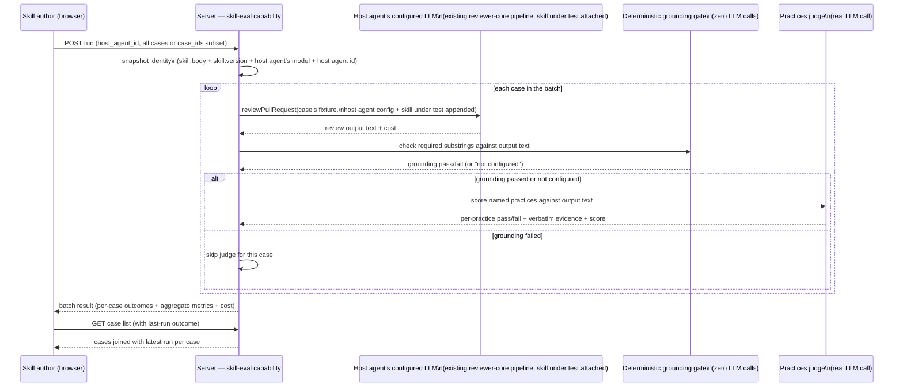

# Spec: Skill Eval Pipeline

**Spec ID:** SPEC-2026-07-06-skill-eval-pipeline
**Status:** draft
**Date:** 2026-07-06
**Affects:** full-stack (server: new run/scoring capability registered against the existing `skills` module's `owner_kind='skill'` eval cases, plus a new batch-persistence capability · client: rich Evals tab inside SkillDetail, replacing today's minimal list)
**Supersedes:** —

## 1. Problem & Motivation

A skill author who edits a skill's body today has no way to know whether the edit made the skill better or worse at doing its one job — surfacing a specific kind of issue in a review — without manually attaching it to an agent, running a review, and eyeballing the output. Skills already have an eval-case table (`owner_kind='skill'` rows in `eval_cases`) and a minimal case list in the UI, but there is no way to run those cases, no scoring, and no history. Unlike an agent (which owns a model, provider, and system prompt), a skill is inert on its own — a skill's body only becomes observable behavior once a host agent's review pipeline is run with that skill's text included in the prompt. This feature closes that gap: it lets a skill author pick a host agent, run the skill's case set through that agent's live review pipeline (with the skill included), and turns the result into a judged quality score plus a cheap deterministic grounding check — so "did my prompt edit help or hurt this skill" becomes a repeatable, comparable measurement instead of a one-off manual check. The persona is the skill's own author/maintainer.

## 2. Goals / Non-goals

**Goals:**
- Let a skill author create an eval case for a skill in three ways: hand-authored through a Case Editor, promoted in one click from a finding on a real PR review (author explicitly confirms which skill the finding should be attributed to, since a finding belongs to the agent that ran, not to any one of its skills), or via the demo seed data.
- Let a skill author select which agent in the workspace acts as the **host agent** for a run, defaulting to the workspace's primary/demo reviewer agent.
- Run the skill's case set (or a single case) through the host agent's live review pipeline with the skill under test added to whatever skills the host agent already has linked — a **marginal-contribution** run, not an isolated one — producing real review output text per case.
- Score each case's review output with the SAME two-tier judging approach already used by this repo's own harness (`evals/` package): a cheap, deterministic **grounding** check (do all of the case's required substrings appear in the output?) that runs first and gates the second tier; a **practices** judge (a real LLM call) that scores each named practice independently as pass/fail with a required verbatim evidence quote, only when grounding passed or no grounding was configured.
- Compute and persist, per batch: judge score (average across judged cases), grounding pass rate, cases-passing count, and cost — the skill-side equivalent of the agent-eval pipeline's metrics strip.
- Show every case in a skill's set with its most recent run outcome, using the same status vocabulary and visual language already established for agent cases (never run / passed / failed / error), adapted to grounding+judge semantics.
- Persist every batch and every case-run so metrics are computable immediately and a future trend view over a skill's batches is cheap to add later without re-deriving history.
- Make the skill-eval run route accessible uniformly for every skill in the workspace, following the same workspace-scoping, concurrency-cap, and rate-limit conventions already established by the agent-eval pipeline.

**Non-goals:**
- Trend chart UI for a skill's batches over time — deferred; this spec's batch persistence is deliberately structured so a future trend view can reuse the same batch/run history without new data collection.
- Batch Compare UI (side-by-side old-batch vs new-batch) for skills — deferred, same rationale.
- A KPI-delta strip (vs. previous batch) for skills — deferred, same rationale.
- The two-panel, source-aware Case Editor redesign — the skill Case Editor in this feature's scope may reuse the existing, simpler Case Editor pattern; the richer redesign is separate future work.
- Cloning an existing agent-owned eval case into a skill-owned case (or vice versa) — explicitly out of scope; a skill case is only created via the three paths listed in Goals.
- An "isolated" run mode (host agent stripped down to only the skill under test, with no other linked skills) — this spec's run semantics are marginal-contribution only (skill added to the host agent's existing linked skills); an isolation mode is not built here.
- A separate, standalone model picker for skill-eval runs — the run's model is whatever model the selected host agent is currently configured with; changing the run's model means changing which host agent is selected, not picking a model independently.
- Recall/precision/citation-accuracy scoring (the agent-eval pipeline's matching-based metrics) for skill cases — a skill case's expected outcome is expressed as judged practices and grounding substrings, not as file/line-range `must_find`/`must_not_flag` expectations; the two scoring methodologies are not unified by this spec.
- Zero-LLM-call scoring — unlike the agent-eval pipeline, this feature's practices judging is itself a real LLM call; this spec does not claim or require zero-LLM scoring.
- Any eval capability for `owner_kind='agent'` cases — this spec's routes, UI, and scoring apply to `owner_kind='skill'` cases only; the existing agent-eval pipeline is untouched.
- Exposing skill-eval capability as an MCP tool.
- A workspace-wide dashboard aggregating every skill's evals into one view.

## 3. User Stories

- As a skill author, I want to hand-author a case for my skill describing a scenario I expect it to catch, so that I can test my skill's wording before it ships.
- As a skill author, I want to promote a real finding from a PR review into a case for the skill I believe contributed to catching (or should have caught) it, so that a real observation becomes a permanent, re-runnable check without manual data entry, and I get to say explicitly which skill it belongs to.
- As a skill author, I want to pick which agent in the workspace acts as the host for a run, so that I can test my skill in the context of the agent(s) it's actually meant to be used with.
- As a skill author, I want to run my skill's whole case set with one click after editing its body, so that I get an immediate, objective before/after read on judge score, grounding pass rate, and cases passing.
- As a skill author, I want to run a single case in isolation while I'm calibrating that case's practices/grounding, so that I don't have to pay for and wait on a full batch just to check one case.
- As a skill author, I want to see every case in my skill's set with its last outcome at a glance — including whether it failed on the cheap grounding gate or on the judge — so I know immediately what to fix.

## 4. Workflow & Module Communication

```mermaid
flowchart TD
    A[Skill author opens Evals tab on a skill] --> B{Case set exists?}
    B -- no cases --> C[Empty state: hint to create manually,\npromote from a finding, or rely on seed data]
    B -- has cases --> D[Case list: status icon, name,\npractices/grounding summary, per-row actions]

    D -- click 'Run all evals' --> E[Select/confirm host agent\n(defaults to primary/demo reviewer)]
    D -- click per-row run --> E
    E --> F[POST run: full case set or one case_id,\nagainst the chosen host agent]

    D -- click edit --> G[Case Editor: prompt/diff fixture,\npractices list, grounding substrings, threshold]
    D -- click delete --> H[Confirm modal, then delete case]

    subgraph Finding[On a PR's Finding Card]
        I[Author clicks 'promote to skill eval case'\non an accepted or dismissed finding] --> J[Author explicitly selects\nwhich skill this case belongs to]
        J --> K[Case created for that skill,\nfixture = the finding's file diff hunk(s)]
    end
    K --> D

    F --> L[Batch: one host-agent + skill-body snapshot,\none run per case in the set]
    L --> M[Each case run: host agent's review pipeline,\nskill under test added to its already-linked skills]
    M --> N[Grounding gate: required substrings\nchecked against the review output text]
    N -- grounding fails --> O[Case fails on grounding;\njudge is skipped for this case]
    N -- grounding passes or none configured --> P[Practices judge: LLM call scores\neach named practice pass/fail + verbatim evidence]
    P --> Q[Case passes only if grounding fully\npresent AND judge score >= threshold]
    O --> R[Batch aggregate: judge score,\ngrounding pass rate, cases passing, cost]
    Q --> R
    R --> S[Case list refreshed with new outcomes;\nmetrics strip updated]
```



## 5. Acceptance Criteria (EARS)

### Case management

- **AC-1** (Ubiquitous): Every case listing, run, and scoring operation introduced by this feature SHALL operate only on eval cases whose `owner_kind` is `skill` and whose `owner_id` matches the skill being viewed.
- **AC-2** (Event-driven): WHEN a skill author saves a hand-authored case in the Case Editor, the system SHALL require at least one of a non-empty `practices` list or a non-empty `grounding` list before allowing the save, so no case is created with nothing to evaluate.
- **AC-3** (Unwanted behavior): IF a hand-authored case's fixture (prompt/diff) is empty, THEN the system SHALL show an inline validation error and SHALL NOT save the case.
- **AC-4** (Event-driven): WHEN a skill author clicks the "promote to skill eval case" action on an accepted or dismissed finding, the system SHALL require the author to explicitly select which skill in the workspace the case belongs to before creating it — the system SHALL NOT infer or auto-attribute the skill.
- **AC-5** (Event-driven): WHEN a case is created from a finding, the system SHALL capture that finding's file's diff hunk(s) as the case's fixture — not the entire PR diff — reusing the same file-scoped extraction already used by the agent-eval pipeline's finding-to-case promotion.
- **AC-6** (Event-driven): WHEN a case is created from an accepted finding, the system SHALL default its practices to include a positive expectation that the review output identifies the finding's subject matter, and SHALL default its grounding to key terms drawn from that finding.
- **AC-7** (Event-driven): WHEN a case is created from a dismissed finding, the system SHALL default its practices to include a negative expectation that the review output does NOT flag the finding's subject matter (evaluated by the judge, since a substring-presence grounding check cannot express absence).
- **AC-8** (Ubiquitous): A created case's stored provenance SHALL record whether it originated from a finding (including the source finding's id and PR number) or was authored manually, mirroring the existing `EvalCaseSource` distinction used for agent cases.
- **AC-9** (Event-driven): WHEN a skill author deletes a case, the system SHALL require an explicit confirmation step before deletion.
- **AC-10** (Ubiquitous): A case's threshold for judge-score passing SHALL default to 0.6 (the harness's existing default threshold value) when the author does not set one explicitly.

### Running

- **AC-11** (Event-driven): WHEN a skill author triggers "Run all evals" for a skill, the system SHALL require a host agent to be selected (defaulting to the workspace's primary/demo reviewer agent) and SHALL create one batch covering every case currently in that skill's case set.
- **AC-12** (Event-driven): WHEN a skill author triggers a per-row single-case run, the system SHALL create a batch scoped to only that one case, using the same run mechanism and host-agent selection as a full-set run.
- **AC-13** (Ubiquitous): Every case run within a skill-eval batch SHALL invoke the host agent's own already-configured review call (provider, model, system prompt) with the skill under test added to whichever skills the host agent already has linked — a marginal-contribution run, never an isolated run with only the skill under test attached.
- **AC-14** (Ubiquitous): A batch whose run was scoped to a strict subset of the skill's case set via an explicit case-selection input SHALL be recorded as a **calibration batch**, mirroring the agent-eval pipeline's full/calibration distinction.
- **AC-15** (Unwanted behavior): IF one case's run fails at runtime (provider error, timeout, or equivalent) within an otherwise full-set batch, THEN the system SHALL continue running the remaining cases in that batch, SHALL mark the failed case with a distinct error state (not the same as a grounding failure or a below-threshold judge score), and SHALL record the batch as a **degraded batch**.
- **AC-16** (Ubiquitous): A degraded batch's aggregate metrics (judge score, grounding pass rate, cases-passing count) SHALL be computed only from the cases that were successfully evaluated in that batch.
- **AC-17** (Event-driven): WHEN a skill-eval batch is created, the system SHALL record a snapshot identity for that batch derived from the combination of the skill's body, the skill's version number, the host agent's model, and the host agent's id — never from the skill's body alone.
- **AC-18** (Unwanted behavior): IF a skill author repeats "Run all evals" or a single-case run in rapid succession, THEN the system SHALL rate-limit and cap concurrent execution of the run route, following the same concurrency-cap and rate-limit conventions already used by the agent-eval pipeline's run route.
- **AC-19** (Ubiquitous): The skill-eval run route SHALL respond immediately with an accepted batch identifier and SHALL execute the batch's case runs detached from the request/response cycle, following the same 202-Accepted-plus-client-polling pattern already used by the agent-eval pipeline's run route.

### Scoring (grounding gate + practices judge)

- **AC-20** (Ubiquitous): A case's grounding check SHALL pass only when every substring listed in that case's `grounding` list is present in the review output text produced for that case's run; a case with an empty or absent `grounding` list SHALL be treated as having no grounding requirement (neither pass nor fail contributes to the grounding gate).
- **AC-21** (Unwanted behavior): IF a case's grounding check fails, THEN the system SHALL NOT invoke the practices judge for that case, and SHALL record that case's outcome as a grounding failure distinct from a judge-score failure.
- **AC-22** (Ubiquitous): WHERE a case's grounding check passes (or the case has no grounding requirement) AND that case defines a non-empty `practices` list, the system SHALL invoke a practices judge that scores each practice independently as pass or fail, requiring a verbatim quote from the review output as evidence for any practice marked passed.
- **AC-23** (Ubiquitous): A case's judge score SHALL be computed as the count of practices marked passed divided by the total count of practices judged for that case.
- **AC-24** (Ubiquitous): A case SHALL be considered passed when its grounding check passed (or had no requirement) AND (it has no practices to judge, or its judge score is greater than or equal to its threshold).
- **AC-25** (Ubiquitous): A batch's aggregate judge score SHALL be computed as the average of the judge scores of every case in the batch that reached the judging tier (i.e. excluding cases that failed grounding and never reached the judge, and excluding runtime-errored cases).
- **AC-26** (Ubiquitous): A batch's grounding pass rate SHALL be computed as the count of cases whose grounding check passed (or had no requirement), divided by the total count of cases in the batch that were successfully run (excluding runtime-errored cases).
- **AC-27** (Ubiquitous): Computing a case's grounding result SHALL make zero LLM calls; computing a case's practices judge result SHALL make exactly one LLM call per judged case — this feature's scoring is a two-tier pipeline, not a zero-LLM pipeline, and this distinction SHALL be reflected everywhere cost or call count is surfaced to the author.
- **AC-39** (Event-driven): WHEN the author edits a skill-eval case, the system SHALL allow setting a per-case judge pass threshold (a number between 0 and 1 inclusive, defaulting to 0.6), used as the gate "judge score ≥ threshold" in AC-24; this value SHALL be persisted with the case and applied at run time for every subsequent run of that case, and SHALL be rejected with an inline validation error if set outside the 0–1 range.

### History and metrics

- **AC-28** (Event-driven): WHEN a skill author opens the skill's Evals tab, the system SHALL show every case in that skill's set joined with that case's most recent run outcome.
- **AC-29** (Ubiquitous): A case that has never been run SHALL be shown with a distinct "never run" state and SHALL NOT show any pass/fail summary text.
- **AC-30** (Ubiquitous): A case's most recent outcome SHALL be shown as one of: never run, passed, failed-grounding, failed-judge, or error — each visually distinct, so an author can tell at a glance whether a failure happened at the cheap gate or at the judged tier.
- **AC-31** (Event-driven): WHEN a skill author opens the Evals tab, the system SHALL show a metrics strip summarizing the latest batch's judge score, grounding pass rate, cases-passing count (N/M), and cost — the skill-side equivalent of the agent-eval pipeline's metrics strip, adapted to this feature's scoring vocabulary.
- **AC-32** (Ubiquitous): The batch history (server-side persistence, not necessarily a client-visible history table in this feature's UI scope) SHALL retain, per batch: timestamp, snapshot identity, host agent id, the aggregate metrics, cost, and a status indicator (clean / degraded / calibration), and SHALL retain per-case outcomes sufficient to support a future trend or compare view without re-running anything.

### Cost and observability

- **AC-33** (Ubiquitous): Every case run's cost (review call cost plus, when the judge was invoked, judge call cost) SHALL be attributable per case and aggregable per batch, using the same cost-accounting convention already used for agent-eval runs and real PR review runs.
- **AC-34** (Ubiquitous): WHEN a batch runs against the workspace's cheap default model for both the host agent and the judge, the system SHALL keep the batch's total cost observable in the run's stored trace/cost fields, verifiably at or under $0.15 for the seeded reference case set size (higher than the agent-eval pipeline's $0.10 bar, since this pipeline includes a real judge call per case in addition to the review call).

### Scope and workspace boundaries

- **AC-35** (Ubiquitous): Every skill-eval-case and skill-eval-run query introduced by this feature SHALL be scoped to the requesting workspace.
- **AC-36** (Ubiquitous): The skill Evals tab and all skill-eval capabilities described by this spec SHALL apply uniformly to every skill in the workspace; each skill SHALL have its own isolated case set, its own batches, and its own history, addressed by that skill's own id.
- **AC-37** (Ubiquitous): The acceptance bar of "at least 5 seeded cases" SHALL be met for at least one skill in the workspace (the primary demo skill) — it is not a requirement that every skill in the workspace independently meets this bar.
- **AC-38** (Ubiquitous): The seeded portion of the acceptance-bar case set SHALL be produced by the existing idempotent demo-data seed flow — re-running the seed SHALL NOT duplicate previously seeded cases.

## 6. Edge Cases

| Case | Expected behavior | Covered by |
|---|---|---|
| Skill has zero eval cases | Empty state with hints: manual creation, promote-from-finding, or rely on seed data | AC-1 (implicitly — nothing to run) |
| Case has never been run | Distinct "never run" state, no pass/fail summary shown | AC-29 |
| Case has no `grounding` list at all | Grounding gate treated as automatically satisfied; judge runs on `practices` alone (if any) | AC-20, AC-22 |
| Case has `grounding` but empty `practices` | Case passes purely on the grounding gate; no judge call is made, cost has no judge component | AC-22, AC-24, AC-27 |
| Case fails the grounding gate | Judge is never invoked for that case; outcome recorded as a grounding failure, distinct from a judge-score failure | AC-21, AC-30 |
| Case passes grounding but judge score is below threshold | Outcome recorded as a judge-score failure, distinct from a grounding failure | AC-24, AC-30 |
| One case in a full-set batch fails at runtime (provider error/timeout) | Batch continues; that case → error state; batch marked degraded; aggregate metrics computed from the remaining successfully-run cases only | AC-15, AC-16, AC-25, AC-26 |
| Single-case calibration run | Same route, one case_id; recorded as a calibration batch | AC-12, AC-14 |
| Rapid repeated "Run all evals" clicks | Rate-limited / concurrency-capped, following the agent-eval pipeline's precedent | AC-18 |
| Finding-derived case creation attempted without the author selecting a target skill | Blocked — the system never infers which skill a finding belongs to | AC-4 |
| Skill's body changes between two batches (version bumps), host agent unchanged | New batch's snapshot identity differs from the prior batch's — treated as a different skill version for future comparison purposes | AC-17 |
| Same skill body/version re-run against two different host agents | Two batches with different snapshot identities (host agent id differs) — never confused with each other | AC-17 |
| Host agent has zero other linked skills at run time | Marginal-contribution run proceeds with only the skill under test attached (there is nothing else to add it "alongside") — not treated as an error | AC-13 |
| Cross-workspace request for a skill's eval cases/runs | Behaves as not-found / empty, never leaks another workspace's data | AC-35 |
| Author edits a case's threshold after a prior run | Historical runs keep their originally recorded pass/fail outcome; only future runs use the new threshold | AC-32 (persisted-at-write-time convention, mirroring the agent-eval pipeline) |
| Author sets a case's threshold outside 0–1 (e.g. negative, or above 1) | Inline validation error; edit not saved | AC-39 |

## 7. Non-functional

- WHEN a batch runs against the workspace's cheap default models (host agent + judge) on the seeded reference case set, the system SHALL keep total batch cost at or under $0.15, verifiable from the batch's own stored cost trace — verify: inspect the batch's persisted cost field(s) after a run.
- The skill-eval run route SHALL be rate-limited and concurrency-capped consistent with the existing agent-eval run route's precedent (exact numeric limits are an implementation-planner decision, expected to match or mirror the agent-eval pipeline's) — verify: automated test asserting a burst of rapid calls is throttled, not fully executed in parallel.
- The grounding gate SHALL make zero LLM calls for any batch size — verify: unit test asserting no LLM provider mock is invoked during the grounding-only path when a case has no `practices`.
- The practices judge SHALL make exactly one LLM call per judged case, never more — verify: unit test asserting call count equals the number of cases that reached the judging tier.

## 8. Inputs (Provenance)

| Input | Provenance |
|---|---|
| Case fixture (prompt/diff) for a finding-derived case (that finding's file's hunk(s)) | [reused: existing PR diff already loaded for the review that produced the finding, via the same file-scoped extraction the agent-eval pipeline already uses] |
| Case fixture (prompt/diff) for a manually authored case | [new: user-authored input] — pasted directly by the skill author in the Case Editor |
| Case `practices` and `grounding` lists, default-populated from an accepted/dismissed finding | [reused: existing Finding record + accept/dismiss action], with the practice/grounding wording itself being [new: 0 LLM call — deterministic templating from the finding's stored fields, not an LLM-generated summary] |
| Host agent configuration used for a run (system prompt, model, provider, already-linked skills) | [reused: existing `agents` + `agent_skills` configuration] |
| Skill body under test | [reused: existing `skills.body` current content at run time] |
| Review output text produced by a case run | [reused: existing reviewer-core pipeline] — the SAME `reviewPullRequest()`-family call already used for real PR reviews and for agent-eval runs, invoked against a case's fixture with the skill under test appended to the host agent's linked skills |
| Grounding pass/fail per case | [deterministic: new skill-eval grounding logic] — substring presence check against the review output text, zero LLM calls, mirroring the harness's existing `patternMatch` approach |
| Practices judge verdict per case (pass/fail per practice + verbatim evidence + score) | [new: 1 LLM call per judged case] — a real LLM call is unavoidable here: judging whether free-text review output demonstrates a named practice, with a verbatim-quote evidence requirement, is a natural-language judgment call that a deterministic check cannot make; this mirrors the harness's existing `llmJudge` approach, adapted to run server-side |
| judge score / grounding pass rate / cases-passing per batch | [deterministic: new skill-eval scoring logic] — pure aggregation over already-produced per-case grounding results and judge verdicts, zero additional LLM calls beyond the per-case judge calls already counted above |
| Snapshot identity (batch versioning key) | [deterministic: derived from existing skill + agent configuration] — fingerprint of skill body + skill version + host agent's model + host agent id |
| Seeded demo-repo cases (≥5 for the primary demo skill) | [reused: existing demo repo + seed flow] — idempotent via the existing `pnpm db:seed` convention |

## 9. Contracts

The following are interface-level shapes this feature's server and client agree on. Field names and meanings only — no code, no schema syntax.

**Skill eval case (as listed to the client, joined with its last-run outcome):**

| Field | Type (conceptual) | Meaning | Null means |
|---|---|---|---|
| id | id | Case identifier | never null |
| skill_id | id | The skill this case belongs to | never null |
| name | text | Human-readable case name | never null |
| source | enum: finding \| manual | Provenance of the case | never null |
| source_finding_id | id | The finding this case was created from | not created from a finding |
| source_pr_number | number | The PR number the source finding came from | not created from a finding |
| fixture | text | The diff/code/scenario fed to the host agent for this case | never null (may be empty only pre-save, rejected by AC-3) |
| practices | list of text | Practice statements the judge scores independently | empty list = no judged tier for this case |
| grounding | list of text | Substrings that must all appear in the output before the judge runs | empty list = no grounding gate for this case |
| threshold | number 0–1, editable per case | Minimum judge score to pass, when practices are defined; editable by the author in the Case Editor (AC-39) | uses the default of 0.6 |
| last_run_status | enum: never_run \| passed \| failed_grounding \| failed_judge \| error | Outcome of the most recent run of this case | never null (defaults to `never_run`) |
| last_run_summary | text | Human-readable outcome summary (e.g. which grounding terms were missing, or the judge score) | no run yet |
| last_host_agent_id | id | The host agent used for the most recent run | no run yet |

**Skill eval batch (one run of a skill's cases against a chosen host agent):**

| Field | Type (conceptual) | Meaning | Null means |
|---|---|---|---|
| id | id | Batch identifier | never null |
| skill_id | id | The skill this batch evaluated | never null |
| host_agent_id | id | The agent used to run the review pipeline for this batch | never null |
| kind | enum: full \| calibration | Whether the run covered the whole case set or an explicit subset | never null |
| status | enum: clean \| degraded | Whether every case in a full batch was evaluated successfully, or at least one errored at runtime | calibration batches use a comparable per-case status without this label |
| snapshot_identity | opaque identity | Fingerprint of (skill body + skill version + host agent's model + host agent id) at run time | never null |
| judge_score | number 0–1 | Average judge score across cases that reached the judging tier | no cases reached the judging tier |
| grounding_pass_rate | number 0–1 | Fraction of successfully-run cases whose grounding check passed (or had no requirement) | no cases were successfully run |
| cases_passing | number | Count of cases in the batch marked passed (see AC-24) | never null (0 is a valid value) |
| cases_total | number | Count of cases targeted by this batch | never null |
| cost_usd | number | Total cost of the batch's case runs, including judge calls | cost unknown for at least one run |
| ran_at | timestamp | When the batch was started | never null |

**Skill eval per-case outcome (element of a batch's case breakdown):**

| Field | Type (conceptual) | Meaning | Null means |
|---|---|---|---|
| case_id | id | The case this outcome belongs to | never null |
| case_name | text | Case name at run time | never null |
| status | enum: passed \| failed_grounding \| failed_judge \| error | This case's outcome for this specific run | never null |
| grounding_missing | list of text | Which required substrings were absent (empty if grounding passed or was not configured) | no grounding requirement |
| judge_score | number 0–1 | This case's judge score | judge was not invoked (grounding failed, or no practices defined) |
| judge_evidence | list of (practice, passed, evidence quote) | Per-practice judge results with verbatim evidence | judge was not invoked |
| cost_usd | number | This case's run cost (review + judge, if invoked) | cost unknown for this run |
| error_message | text | Concise cause string for a runtime-failed case | case did not error |

## 10. Untrusted Inputs

This feature reads two sources of text authored outside the system as part of its data flow:

- **Case fixtures** (both finding-derived diff-hunk snapshots and manually pasted prompts/diffs) — the same trust class as a real PR diff already sent through the reviewer pipeline today; processed as data only, never as instructions, via the existing prompt-assembly wrapping already used for all diff/prompt content.
- **Review output text** fed into the grounding gate and the practices judge — this text is itself LLM-generated (from the host agent's own review call), not directly attacker-authored, but it is treated as data for both the deterministic substring check and the judge's evaluation prompt, never as instructions to either. The judge prompt structure (rubric + practices + output, binary pass/fail, verbatim-evidence requirement) mirrors the harness's existing `llmJudge` construction, which already treats the judged output as inert content to be evaluated, not as a command stream.

Case `name` and free-text fields authored by the skill author are covered by the product's existing default JSX-escaping safety net product-wide; no new untrusted-input class beyond what the existing review and agent-eval pipelines already handle.

## 11. [NEEDS CLARIFICATION]

- **Exact table shape for skill-eval batch persistence.** `eval_batches.agent_id` is `NOT NULL` and foreign-keys to `agents` — a skill batch has no single agent identity in that same sense (it has a skill id AND a host agent id). This spec requires only that batch persistence exist for skill runs (AC-17, AC-32), that `eval_batches`' and `eval_cases`' existing columns are never altered, and that any new table is added via a new numbered migration (additive-only, per this repo's hard conventions). Whether the implementation introduces a new `skill_eval_batches` table (with its own `skill_id` + `host_agent_id` columns) or generalizes `eval_batches` some other additive way is left entirely to the implementation planner.
- **Where a skill-eval case's `practices`/`grounding`/`threshold` fields land on the existing `eval_cases` row.** The table already has `input_diff`, `expected_output` (JSONB), `input_meta` (JSONB), and `notes` columns with no schema for skill cases' harness-shaped data yet. This spec fixes only the conceptual contract (see §9) and requires additive-only handling of the existing columns; the exact mapping (e.g. fixture → `input_diff`, `{practices, grounding, threshold}` → `expected_output`) is left to the implementation planner.
- **Exact seeding mechanics for the ≥5 demo-skill cases** (hand-authored fixtures vs. generated from real seeded PR/finding data) — left to the implementation planner; this spec fixes only the acceptance bar (AC-37) and the idempotency requirement (AC-38).
- **Exact numeric rate limit / concurrency cap** for the skill-eval run route — left to the implementation planner, expected to mirror the agent-eval pipeline's existing precedent (AC-18, §7).
- **Default host agent selection rule** when a workspace has no single obvious "primary/demo reviewer" agent (e.g. a workspace with several agents and none marked as primary) — this spec requires a default to exist (AC-11) but leaves the exact selection rule (most recently created, most-runs, explicitly flagged, etc.) to the implementation planner.
