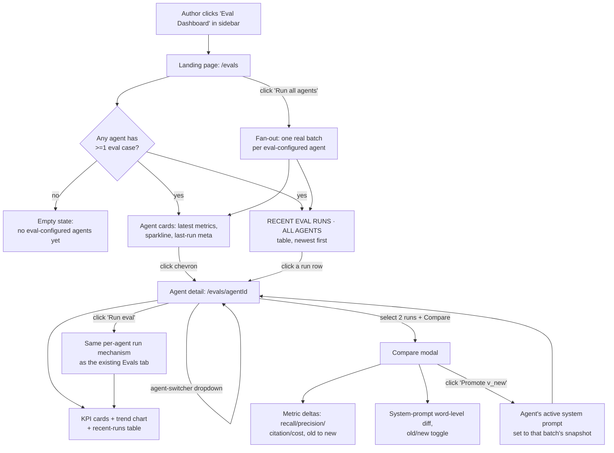
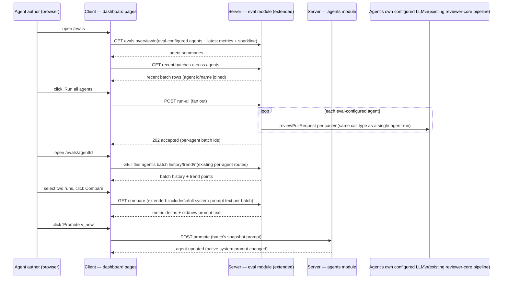

# Spec: Agent Eval Dashboard

**Spec ID:** SPEC-2026-07-07-agent-eval-dashboard
**Status:** draft
**Date:** 2026-07-07
**Affects:** full-stack (server: new cross-agent aggregation routes in the existing `eval` module + a new prompt-promote surface on `agents` · client: two new sidebar-reachable pages, reusing existing EvalsTab sub-components)
**Supersedes:** —

> **Publication note:** the canonical copy of this spec's parent feature for the assignment's submission checklist is published at repo-root `specs/eval-pipeline.md` (SPEC-2026-07-05-eval-pipeline). This spec builds the dashboard that spec explicitly deferred as a Non-goal ("a workspace-wide 'Eval Dashboard' sidebar page aggregating every agent's evals into one view — future work"). The orchestrator, not this agent, is responsible for flipping that Non-goal in the published copy and appending this spec's acceptance criteria there once this draft is approved.

## 1. Problem & Motivation

An agent author who maintains more than one reviewer agent has no single place to see how all of them are doing — each agent's recall/precision/citation-accuracy trend, its last run, and its run history live only behind that agent's own Evals tab, one agent at a time. There is no bird's-eye health view and no fast way to trigger a fresh regression check across every eval-configured agent after a shared change (e.g. a shared skill update or a model-tier default change). This feature adds a workspace-wide landing page that surfaces every agent that has at least one eval case, its latest metrics, and the most recent runs across all of them — and a per-agent detail page reachable both from that landing page and via a quick agent-switcher, without leaving the dashboard context. The dashboard is both a health-monitoring view and a navigation hub: every card, table row, and the agent-switcher exist to get the author to the right agent's detail quickly, not only to display numbers. The persona is unchanged from the parent eval-pipeline feature — the agent's own author/maintainer, not a new read-only auditor role.

## 2. Goals / Non-goals

**Goals:**
- Add one new sidebar entry ("Eval Dashboard") to the existing "SKILLS LAB" section, with its own `g`-nav shortcut, so the dashboard is reachable from anywhere in the app — and verifiably NOT the kind of page that ships unreachable (see AC-1).
- Show, on a landing page, one card per agent that has at least one eval case (data-driven: agents with zero eval cases never appear), each with its latest full-batch recall/precision/citation-accuracy, a recall sparkline, and its last-run metadata (version label, timestamp, pass count).
- Show, on the same landing page, a chronological feed of the most recent eval batches across every eval-configured agent, each row identifying which agent it belongs to and deep-linking to that batch on that agent's detail page.
- Let the author trigger "Run all agents" from the landing page — a real fan-out of eval batches across every eval-configured agent, reusing the same run mechanism each agent's own "Run eval" already uses, rate-limited and concurrency-capped consistent with this codebase's existing fan-out precedent.
- Add a per-agent detail page reachable from the landing page (chevron on the card, or any recent-run row) that reuses the existing per-agent Evals-tab building blocks (KPI cards, trend chart, batch history with compare) in a page-level context, plus an agent-switcher dropdown to hop directly to a different eval-configured agent's detail without returning to the landing page.
- Let the author compare any two batches from the detail page's run history with a full comparison: metric deltas (recall/precision/citation/cost) AND a word-level diff of the two batches' system-prompt text (old vs. new, with a toggle), reusing/extending the existing compare contract.
- Let the author "Promote" a prior batch's system-prompt snapshot as the agent's current active system prompt directly from the compare modal — a real configuration mutation, not a preview-only action.
- Activate the existing inert "View full dashboard →" link inside the per-agent Evals tab (`EvalMetrics.tsx`) to route to this new dashboard.

**Non-goals:**
- Any change to the per-agent Evals tab's own case management (case CRUD, Case Editor, single-case calibration runs) — this feature only adds cross-agent aggregation views and reuses that tab's existing read-side components; case authoring stays exactly as SPEC-2026-07-05-eval-pipeline defined it.
- A workspace-wide dashboard for **skill** evals (`owner_kind='skill'` cases, SPEC-2026-07-06-skill-eval-pipeline) — this feature's aggregation surfaces cover agent-owned eval cases only, mirroring the same `owner_kind='agent'` boundary the parent spec already drew.
- A new permission tier or read-only auditor role distinct from the existing workspace-scoped agent-edit permission — anyone who can already open an agent's Evals tab can see and act on this dashboard; no new access-control concept is introduced.
- The mockup's "GLOBAL" sidebar section (Memory, Multi-Agent Review, Agent Performance, CI Runs) — none of those features exist in this codebase; only the single "Eval Dashboard" nav item under "SKILLS LAB" is in scope.
- Live/streaming updates while "Run all agents" or a single "Run eval" is in flight beyond what the existing per-agent polling convention already provides (batch-detail polling) — the dashboard's own landing-page cards and recent-runs feed refresh on navigation/re-fetch, not via a push channel.
- Any change to how a single agent's own batch is scored, or to the recall/precision/citation-accuracy formulas themselves — this feature only aggregates and displays already-computed batch data across agents.
- Exposing any new dashboard capability as an MCP tool — consistent with the parent spec's existing non-goal for the per-agent surface.
- Historical backfill of full system-prompt text for batches that ran BEFORE this feature ships (see §11) — only batches run after this feature's data-model change carries the full-text field; older batches degrade gracefully in the compare/promote flow (see AC-23).

## 3. User Stories

- As an agent author with several eval-configured agents, I want to land on one page and see every agent's current health (recall/precision/citation-accuracy, at a glance), so that I immediately know which agents are trending down without opening each one individually.
- As an agent author, I want a single "Run all agents" button, so that after a shared change (e.g. a shared skill edit) I can refresh every eval-configured agent's numbers in one action instead of visiting each agent's tab and clicking "Run" N times.
- As an agent author, I want a chronological feed of the most recent runs across all my agents, so that I can spot a regression the moment it happens regardless of which agent produced it.
- As an agent author, I want to click any agent card or recent-run row and land directly on that agent's detail page, so that the dashboard is a fast way IN to the per-agent view, not a dead end.
- As an agent author already on one agent's detail page, I want to switch to a different agent via a dropdown, so that I can compare two agents' trends back-to-back without navigating back through the landing page each time.
- As an agent author reviewing two batches, I want to see exactly what changed in the system prompt between them (not just the metric deltas), so that I can understand *why* a metric moved, not only *that* it moved.
- As an agent author satisfied that an older batch's prompt performed better, I want to promote that batch's prompt back to be the agent's active prompt in one click, so that reverting a regression doesn't require manually copy-pasting text out of a diff view.

## 4. Workflow & Module Communication

## 5. Acceptance Criteria (EARS)

### Sidebar reachability

- **AC-1** (Ubiquitous): The sidebar's existing "SKILLS LAB" section SHALL include exactly one new navigation entry labeled "Eval Dashboard," positioned alongside the existing Skills, Agents, and Conventions entries, with its own keyboard shortcut registered consistently with every other navigation entry's shortcut convention.
- **AC-2** (Ubiquitous): The Eval Dashboard's landing route SHALL be reachable by clicking its sidebar entry from any page in the app — the feature SHALL NOT be considered complete while any other acceptance criterion in this spec is satisfied but the sidebar entry is missing.

### Landing page — agent list

- **AC-3** (Ubiquitous): The landing page's agent list SHALL include only agents that have at least one eval case in the requesting workspace; an agent with zero eval cases SHALL NOT appear, regardless of how many real PR reviews that agent has otherwise run.
- **AC-4** (Event-driven): WHEN the landing page loads and at least one eval-configured agent exists, the system SHALL show, per agent, that agent's latest full batch's recall/precision/citation-accuracy, a recall sparkline built from that agent's own trend history, and a last-run summary (version label, timestamp, pass count out of total cases run in that batch).
- **AC-5** (Unwanted behavior): IF no agent in the workspace has any eval case, THEN the landing page SHALL show an explicit empty state instead of an empty list with no explanation, and SHALL NOT show a "Run all agents" affordance in a state that would have nothing to run.
- **AC-6** (Ubiquitous): An eval-configured agent whose latest batch is degraded (per the parent spec's degraded-batch definition) SHALL be visually distinguishable on its landing-page card from an agent whose latest batch is clean.
- **AC-7** (Event-driven): WHEN the author clicks an agent's card (its chevron affordance), the system SHALL navigate to that agent's detail page.

### Landing page — recent runs across agents

- **AC-8** (Event-driven): WHEN the landing page loads, the system SHALL show a table of the most recent eval batches across every eval-configured agent, ordered newest-first, each row identifying the owning agent's name, the batch's timestamp, its version label, its recall/precision/citation-accuracy, and its pass count.
- **AC-9** (Ubiquitous): The recent-runs table SHALL cap the number of rows shown to a fixed limit and SHALL NOT attempt to render every batch ever run across every agent unbounded.
- **AC-10** (Event-driven): WHEN the author clicks a row in the recent-runs table, the system SHALL navigate to that row's owning agent's detail page with that specific batch identifiable (e.g. pre-selected or scrolled into view) on arrival.

### Landing page — run all agents

- **AC-11** (Event-driven): WHEN the author triggers "Run all agents," the system SHALL start one real eval batch per eval-configured agent in the workspace, each batch using that agent's own already-configured review call (provider, model, system prompt, enabled skills) against that agent's own case set — the same run mechanism a single agent's own "Run eval" already uses, never a distinct or cheaper simulation.
- **AC-12** (Unwanted behavior): IF the author triggers "Run all agents" while a prior workspace-wide run-all is still in flight, THEN the system SHALL rate-limit or reject the repeated trigger consistent with this codebase's existing fan-out precedent, so that a click-burst does not multiply the number of paid batches started.
- **AC-13** (Ubiquitous): The "Run all agents" fan-out SHALL apply a concurrency cap across the agents it runs, consistent with this codebase's existing multi-target fan-out precedent, so that it does not saturate the LLM provider by starting every agent's batch simultaneously.

### Per-agent detail page

- **AC-14** (Ubiquitous): The per-agent detail page SHALL show that agent's name and model, a run count and case-set size in its subtitle, three KPI cards (recall, precision, citation accuracy) each with a value, a sparkline, and a delta versus the previous full batch, a metric-trend chart across full batches, and a recent-runs table scoped to that agent alone.
- **AC-15** (Event-driven): WHEN the KPI delta versus the previous full batch shows a meaningful change in any of the three metrics, the system SHALL show a warning or notice banner summarizing which metric moved and in which direction; WHERE no previous full batch exists yet, the system SHALL NOT show this banner.
- **AC-16** (Event-driven): WHEN the author selects an agent from the detail page's agent-switcher dropdown, the system SHALL replace the page's content with the selected agent's own KPI/trend/run data without requiring a return to the landing page; the dropdown's own list of selectable agents SHALL be limited to eval-configured agents (same criterion as AC-3).
- **AC-17** (Event-driven): WHEN the author triggers "Run eval" on the detail page, the system SHALL start one real batch for that agent alone, using the exact same run mechanism already defined by the parent eval-pipeline spec's full-set run (AC-11 there) — not a new call type.
- **AC-18** (Event-driven): WHEN the author selects exactly two runs from the detail page's recent-runs table, the system SHALL enable a "Compare" action; WHEN fewer than two or more than two are selected, the system SHALL keep that action disabled.

### Compare modal

- **AC-19** (Event-driven): WHEN the author opens the compare modal for two selected batches, the system SHALL show, for recall, precision, citation accuracy, and cost, each batch's own value and the delta from the older to the newer of the two.
- **AC-20** (Ubiquitous): The compare modal SHALL show a word-level diff of the two batches' system-prompt text, with removed text marked distinctly from added text, and a control to toggle between viewing the older and the newer prompt in full.
- **AC-21** (Event-driven): WHEN the author clicks "Promote" on the newer of the two compared batches, the system SHALL set that batch's snapshot system-prompt text as the agent's current active system prompt, and SHALL show a confirmation that the promotion succeeded.
- **AC-22** (Unwanted behavior): IF the author attempts to promote a batch whose snapshot does not include full system-prompt text (see AC-23), THEN the system SHALL disable or reject the promote action for that batch with an explanation, rather than silently promoting an empty or truncated prompt.
- **AC-23** (Ubiquitous): Every eval batch created after this feature ships SHALL persist its agent-snapshot's full system-prompt text (not only an opaque fingerprint or a truncated summary), retrievable by the compare and promote operations; a batch created before this feature shipped, which carries no full-text snapshot, SHALL be treated by the compare/promote flow as a batch with unavailable prompt text (per AC-22), never as an empty-string prompt.

### Cross-agent aggregation surface (server)

- **AC-24** (Ubiquitous): Every new cross-agent read introduced by this feature (the landing page's agent-summary list and its recent-runs feed) SHALL be scoped to the requesting workspace and SHALL include only agent-owned (`owner_kind='agent'`) eval data, mirroring the same scoping and ownership boundary the parent eval-pipeline spec already established for its per-agent routes.
- **AC-25** (Ubiquitous): The prompt-promote operation SHALL be scoped to the requesting workspace and SHALL verify that the batch being promoted belongs to the same agent whose system prompt is being changed, before applying the mutation.
- **AC-26** (Ubiquitous): The prompt-promote operation SHALL reuse the existing agent-versioning mechanism already used whenever an agent's configuration changes (the same mechanism that already snapshots a version on every agent update), so that a promote action is itself undoable through that existing history, not a bypass of it.

## 6. Edge Cases

| Case | Expected behavior | Covered by |
|---|---|---|
| Workspace has zero eval-configured agents | Landing page shows explicit empty state; no "Run all agents" affordance | AC-5 |
| An eval-configured agent's latest batch is degraded | Card visually distinguished from a clean-batch agent | AC-6 |
| Author clicks "Run all agents" twice in rapid succession | Second click rate-limited/rejected, not a second fan-out | AC-12 |
| Workspace has many eval-configured agents | "Run all agents" concurrency-capped, not all started simultaneously | AC-13 |
| Recent-runs feed across all agents grows very large over time | Table capped to a fixed row limit, not unbounded | AC-9 |
| Author is on one agent's detail page and wants a different agent | Agent-switcher swaps content in place, no forced return to landing | AC-16 |
| Author selects only one run, or three+ runs, on the detail page | Compare action stays disabled | AC-18 |
| Two compared batches show no meaningful metric change | Deltas shown as zero/near-zero, not hidden | AC-19 |
| Author tries to promote a batch that predates this feature (no full prompt text stored) | Promote disabled/rejected with explanation, not a blank-prompt promotion | AC-22, AC-23 |
| KPI delta banner would be shown but there is no previous full batch yet (agent's first run) | Banner suppressed entirely, not shown with a fabricated zero delta | AC-15 |
| A recent-run row is clicked for a batch that belongs to an agent not currently eval-configured (edge case: last case since deleted) | Still resolves to that agent's detail page — agent-level Evals capability is independent of current case-set size; only the LANDING PAGE's agent-list membership depends on case count (AC-3), not navigability of an existing batch | AC-10 |
| Cross-workspace request for the aggregation routes or the promote route | Behaves as not-found/empty, never leaks another workspace's data | AC-24, AC-25 |

## 7. Non-functional

- The "Run all agents" fan-out SHALL be rate-limited and concurrency-capped consistent with this codebase's existing `POST /repos/:id/review-all` precedent (exact numeric limits are an implementation-planner decision) — verify: automated test asserting a burst of rapid triggers is throttled, not fully executed in parallel.
- The recent-runs feed across all agents SHALL return in a single request bounded by a fixed limit parameter, never an unbounded scan of all historical batches — verify: automated test asserting the response row count never exceeds the requested/default limit regardless of total batch count in the workspace.
- `pnpm verify:l06` (server, existing script from the parent eval-pipeline spec) SHALL continue to pass after this feature's additions — verify: CI / local run of the script exits 0.
- Every new server route introduced by this feature SHALL enforce workspace scoping identically to the existing per-agent eval routes' convention — verify: automated test asserting a cross-workspace request for the overview, recent-runs, or promote route returns not-found/empty rather than another workspace's data.

## 8. Inputs (Provenance)

| Input | Provenance |
|---|---|
| Eval-configured agent list (agents with ≥1 eval case) | [reused: existing `eval_cases` ownership data] — filtered by `owner_kind='agent'`, grouped by owning agent |
| Per-agent latest full-batch metrics + sparkline points | [reused: existing `eval_batches`/trend data] — the same data the per-agent Evals tab's trend chart already reads, aggregated across agents |
| Recent-runs feed across all agents | [reused: existing `eval_batches` rows] — joined with each batch's owning agent's name, newest-first, limit-bounded |
| "Run all agents" fan-out | [reused: existing per-agent run mechanism] — the SAME `reviewPullRequest()`-based batch run the parent spec already defined (AC-13 there), invoked once per eval-configured agent; zero new LLM call types introduced |
| Compare modal's metric deltas | [reused: existing compare computation] — the same recall/precision/citation/cost delta logic the parent spec's batch-compare already computes |
| Compare modal's system-prompt word-level diff | [deterministic: new text-diff computation] — pure text comparison of two already-stored prompt strings, zero LLM calls |
| Promote action | [reused: existing agent-versioning mechanism] — applies an already-stored batch snapshot's prompt text through the same update path (and version history) an agent's own manual prompt edit already uses; zero LLM calls |
| Full system-prompt text persisted per batch | [new: data-model addition] — not an LLM call; a persistence requirement (see §11) so the compare/promote flow has real text to operate on, rather than only the existing opaque fingerprint |

## 9. Contracts

The following are interface-level shapes this feature's server and client agree on, building on the parent eval-pipeline spec's existing `EvalBatch`/`EvalTrendPointV2`/`EvalBatchCompareResult` shapes. Field names and meanings only — no code, no schema syntax.

**Agent eval summary (one entry in the landing page's agent list):**

| Field | Type (conceptual) | Meaning | Null means |
|---|---|---|---|
| agent_id | id | The agent this summary describes | never null |
| agent_name | text | Display name | never null |
| model | text | Display badge (model identifier) | never null |
| latest_batch | Batch (existing shape) | The agent's most recent full batch, or null | agent has run no full batch yet |
| sparkline_points | list of {ran_at, recall} | Recent full-batch recall values in chronological order, for the card's sparkline | empty list if no full batches yet |
| case_count | number | Total eval cases currently in this agent's set | never null (≥1, since the agent appears in this list) |

**Cross-agent recent batch (one row in the "Recent eval runs · all agents" feed):**

| Field | Type (conceptual) | Meaning | Null means |
|---|---|---|---|
| batch | Batch (existing shape) | The batch itself | never null |
| agent_id | id | The batch's owning agent | never null |
| agent_name | text | Display name for the row | never null |
| pass_count | number | Cases that passed in this batch | never null |
| total_count | number | Total cases run in this batch | never null |

**Run-all-agents result (response to the fan-out trigger):**

| Field | Type (conceptual) | Meaning | Null means |
|---|---|---|---|
| started | list of {agent_id, batch_id} | One entry per agent whose batch was actually started | empty list if no eval-configured agent existed to run |

**Batch — extended (additive field on the existing `EvalBatch`/compare shapes):**

| Field | Type (conceptual) | Meaning | Null means |
|---|---|---|---|
| system_prompt_snapshot | text | The full system-prompt text active on the agent at the time this batch ran | batch predates this feature — prompt text unavailable (compare/promote must degrade per AC-22/AC-23), never an empty string standing in for "no prompt" |

**Compare result — extended (additive on the existing `EvalBatchCompareResult`):**

| Field | Type (conceptual) | Meaning | Null means |
|---|---|---|---|
| prompt_diff_available | boolean | Whether both compared batches carry `system_prompt_snapshot` text | never null |
| deltas.cost_usd | number | Cost delta from the older to the newer batch, additive alongside the existing recall/precision/citation_accuracy deltas | either batch's cost is unknown |

**Promote request (interface-level; exact route shape is the implementation-planner's call):**

| Field | Type (conceptual) | Meaning | Null means |
|---|---|---|---|
| batch_id | id | The batch whose `system_prompt_snapshot` becomes the agent's new active system prompt | never null (required) |

## 10. Untrusted Inputs

This feature reads no new class of externally-authored text beyond what the parent eval-pipeline spec already established. It surfaces:

- **System-prompt text**, already authored by the agent's own author through the existing agent-configuration flow — not attacker- or third-party-controlled; displayed in the compare modal's diff view through the product's existing default JSX-escaping safety net, same as any other already-trusted configuration text shown elsewhere in the app.
- **Agent and case names**, already authored by the agent's own author — same trust class and display handling as the parent spec's case `name`/`notes` fields.

No PR diffs, commit messages, or other third-party-authored content are newly introduced into this feature's data flow; the aggregation views only summarize numbers and metadata already computed by the existing per-agent eval pipeline.

## 11. [NEEDS CLARIFICATION]

- **Exact persistence mechanism for `system_prompt_snapshot`** (AC-23, §9) — whether this is a new nullable column on the existing `eval_batches` table, a widened `agent_snapshot` JSON payload that now includes the full text alongside the fingerprint, or a new adjacent table — is left to the implementation planner, constrained by this repo's standing rule that existing columns are never altered and new tables/columns only arrive via new numbered migrations. Recommended default: add a new nullable column to `eval_batches` (additive, does not touch the existing fingerprint field) so old batches simply read `null` and new batches populate it going forward, satisfying AC-23's backward-compatible degrade path with the smallest schema change.
- **Recent-runs feed row limit (the "N" in "Recent eval runs · all agents")** — the exact default and whether it is user-configurable (vs. a fixed constant) is left to the implementation planner; this spec fixes only that a limit must exist and must be enforced server-side (AC-9, §7). Recommended default: 20 rows, no client-side pagination control in this first version.
- **"Meaningful change" threshold for the detail page's warning banner (AC-15)** — the exact percentage-point threshold that triggers the banner is left to the implementation planner. Recommended default: reuse whatever threshold convention (if any) the parent spec's `KpiDeltaStrip` already applies for visually emphasizing a delta; if none exists, treat any non-zero delta as bannerable but favor the single largest-magnitude metric in the banner's wording.
- **Promote's interaction with an agent's own version history (AC-26)** — whether "Promote" creates a brand-new agent version row identical in mechanism to a manual system-prompt edit, or a specially-labeled version entry noting it came from a batch promotion, is left to the implementation planner. Recommended default: reuse the exact existing version-snapshot path unmodified (no special-cased version label) so promote is indistinguishable, from the versioning system's point of view, from the author manually pasting that same text into the prompt field.
- **Concurrency cap and rate-limit numeric values for "Run all agents" (AC-12, AC-13, §7)** — left to the implementation planner, consistent with the existing `review-all` precedent (max 2/min, concurrency cap 3) unless a different cap is justified by the number of eval-configured agents typically expected in one workspace.
