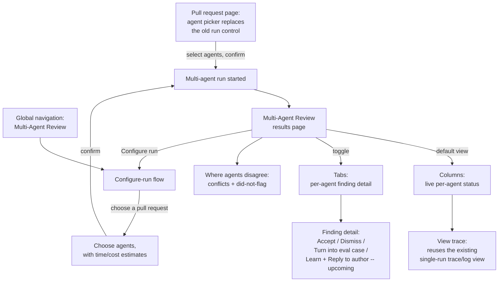

# Spec: Multi-Agent Review

**Spec ID:** SPEC-2026-07-09-multi-agent-review
**Status:** approved
**Date:** 2026-07-09
**Affects:** full-stack (server, client)
**Supersedes:** —

## 1. Problem & Motivation

A workspace member who wants a second (or third, or fifth) specialized opinion on a pull request today has only two choices: run one agent, or run every enabled agent — there is no way to pick a subset, and no way to see the results of several agents side by side. Each agent's run lives in its own row in the timeline; comparing what a Security-focused agent found against what a Performance-focused agent found means opening one run, remembering its findings, opening the next, and doing the comparison in the reader's own head. There is no view that answers "where do these agents actually disagree" — including the case where one agent silently didn't flag something another agent considered worth raising — and no single place to see whether running several specialized agents was worth their combined cost.

The underlying execution engine already runs each agent's review in its own isolated context with failure isolation, and the tooling to inspect a single run's cost, tokens, and live log already exists. What's missing is a selection surface that lets a workspace member choose which agents to run together, a results surface that groups those runs, and — the one genuinely new piece of logic — a way to detect and show where the agents' findings disagree. Interface-level data shapes describing a grouped multi-agent result (per-agent columns, computed disagreement groups) are already agreed and present in this codebase's shared contracts, ahead of any UI or server logic that produces them; this spec is what finally fills those shapes in.

## 2. Goals / Non-goals

**Goals:**
- Replace the existing single-agent-or-all run control, wherever it appears today, with a picker that lets a workspace member choose any subset of enabled agents and see a pre-run time/cost estimate per agent and in aggregate before running.
- Record every run started from that picker — including a run of exactly one agent — as a single grouped multi-agent run, and always land the workspace member on a dedicated results page for it.
- Let a workspace member start a multi-agent run without first having a specific pull request open, by choosing the pull request as part of the same flow.
- Show each participating agent's status live while a run is in progress (running, done, or failed), with cost updating as it becomes known, in a column-per-agent layout.
- Execute a multi-agent run's participating agents concurrently, bounded by a concurrency cap, so the run's real wall-clock time approximates its slowest participating agent rather than the sum of all of them — leaving a single-agent run and the existing all-agents fan-out unchanged (see AC-44).
- Provide a second, tab-per-agent layout with full per-finding detail (confidence, suggested fix, and the same accept/dismiss/eval-case actions already available elsewhere), reachable from the same results page without re-running anything.
- Detect and surface where the participating agents' findings disagree on the same code location — including the case where one agent flagged something and another agent that also reviewed the same pull request did not flag it at all.
- Let a workspace member open any participating agent's existing trace and live-log view directly from this page, without building a second, separate trace viewer.
- Make the cost tradeoff of running several agents versus one visible and inspectable — per agent and in total — without asserting a wall-clock savings this spec cannot back with today's actual execution behavior (see Non-goals and §11).
- Seed enough demonstration data — a small specialized-agent roster and prior runs against an existing demonstration pull request — that this whole flow, including a genuine disagreement, can be exercised without any manual setup.

**Non-goals:**
- Any change to the review engine's analysis quality, prompt content, or grounding logic. This feature only selects, groups, and compares runs that already happen the same way they do today.
- The pre-publish finding curation surface (a "compose review" step that lets a workspace member curate findings before they're published) — a different feature, not touched here.
- Any CI export or CI runner wiring — this feature is entirely about in-app review runs.
- Making "Learn" and "Reply to author" functional — they appear on this page as visibly upcoming actions, not working ones, in this version.
- Changing how a single-agent run or the existing all-agents review fan-out execute. Both remain exactly as they are today (one agent after another, in the case of the all-agents fan-out); only a multi-agent run's own participating agents gain concurrent execution (see Goals, AC-44).
- A workspace-wide history or list view of every multi-agent run ever started, across every pull request. This feature's results page is reached either by starting a new run or by opening one specific prior run; browsing all past multi-agent runs across the whole workspace is out of scope.
- Any nav-adjacent feature area referenced only by name in earlier design exploration (a memory/knowledge browser, a per-agent performance-trend page) — neither is built by this spec.

## 3. User Stories

- As a workspace member reviewing a pull request, I want to pick a subset of my enabled agents and see per-agent and combined time/cost estimates before running, so I can decide how many specialized lenses are worth the cost.
- As a workspace member without a specific pull request open, I want to start a multi-agent run by choosing both the pull request and the agents in one flow, so I don't have to first navigate into a pull request to begin.
- As a workspace member who starts a run with just one agent selected, I want it handled the same consistent way as a run with several agents, so I don't have to learn two different results experiences depending on how many agents I picked.
- As a workspace member watching a run in progress, I want to see each agent's status and accruing cost update live, so I don't have to guess whether something is stuck.
- As a workspace member comparing several agents' results, I want to see exactly where they disagree — including where one flagged something and another silently didn't — so I can judge which finding is actually worth acting on.
- As a workspace member inspecting one finding, I want its confidence, suggested fix, and the same accept/dismiss/eval-case actions I already use elsewhere, so multi-agent review doesn't feel like a disconnected second findings experience.
- As a workspace member curious about cost tradeoffs, I want to see each agent's and the whole run's cost and tokens, and be able to open any one agent's trace to see why a finding cost what it cost and what the grounding gate rejected, so I can judge whether running several specialized agents was worth it.

## 4. Workflow & Module Communication



```mermaid
sequenceDiagram
  participant U as Workspace member
  participant C as Client — Multi-Agent Review UI
  participant S as Server — reviews module, extended
  participant X as Existing run engine + per-run live stream
  participant F as Existing findings storage

  U->>C: Pick a pull request + N agents, confirm
  C->>S: Start a grouped multi-agent run for these agents
  S->>S: Create the run group and one run per agent\n(existing per-run creation, now linked together)
  S->>X: Execute each agent's review concurrently, bounded by a cap\n(new scheduling around the existing engine; existing per-agent failure isolation preserved)
  X-->>C: Live per-agent status and log\n(existing stream, one subscription per run)
  X->>F: Persist findings as each agent's run completes\n(existing behavior)
  U->>C: Open the run's results page
  C->>S: Request the composed run (columns + disagreements)
  S->>F: Read this run group's findings across its agent runs
  S->>S: Compute disagreement groups\n(new, deterministic, zero LLM calls)
  S-->>C: Composed result: per-agent columns + disagreement groups
  U->>C: Click "View trace" on a column or a finding
  C->>C: Open the existing single-run trace/log view for that run
```

The seam between what's new and what's reused: the review pipeline itself — analyzing the diff, calling the model, grounding findings, streaming live status, persisting findings, and the trace/log view — is the existing per-agent review machinery, used exactly as it is today. What's genuinely new is: accepting more than one specific chosen agent in a single run request (today's request shape accepts only exactly one agent or a blanket "every enabled agent"); running that request's participating agents concurrently rather than one after another, bounded by a concurrency cap, while preserving the existing per-agent failure isolation; the grouping that ties those runs together as one run; and the deterministic computation that turns their already-persisted findings into disagreement groups.

## 5. Acceptance Criteria (EARS)

**Agent picker — replaces the existing single-agent-or-all run control**

- **AC-1** (Ubiquitous): Wherever the workspace member can currently start a review run for a pull request, the system SHALL offer a picker listing every enabled agent as a checkbox row, each showing that agent's icon, name, and a one-line summary.
- **AC-2** (Ubiquitous): The picker SHALL provide a single control to select every agent at once and to clear the selection back to none.
- **AC-3** (Event-driven): WHEN the workspace member starts a run from the picker with one or more agents selected — including exactly one — the system SHALL record it as a single grouped multi-agent run and SHALL navigate to that run's results page.
  > *Why*: [decision, not re-litigated] any run started from this picker becomes a grouped multi-agent run, so every run started going forward is inspected through the same one consistent results experience, regardless of how many agents were chosen.
- **AC-4** (Unwanted behavior): IF no agent is selected, THEN the run action SHALL remain disabled.
- **AC-5** (Unwanted behavior): IF the workspace has no enabled agents at all, THEN the picker SHALL show an explicit empty state directing the workspace member to create or enable an agent, rather than an empty selectable list.

**Pre-run time/cost estimation**

- **AC-6** (Ubiquitous): Each agent's pre-run estimate SHALL be the average duration and average cost of that agent's last 3 successful runs on the current repository.
  > *Why*: [decision, not re-litigated].
- **AC-7** (Unwanted behavior): IF an agent has no successful run history on the current repository, THEN its estimate SHALL display as unavailable, with an explicit "no history" marker, rather than a fabricated number.
- **AC-8** (Event-driven): WHEN one or more agents are selected, the system SHALL show a combined estimate computed as the MAXIMUM of the selected agents' time estimates and the SUM of their cost estimates.
  > *Why*: [decision, not re-litigated] — money is spent per agent and does not parallelize, so it sums; wall-clock time reflects the agents running together, not one after another, so it takes the largest single estimate. Worked example confirmed against the design reference: three agents estimated at 8.2s/$0.06, 6.9s/$0.04, and 7.1s/$0.05 combine to "≈8.2s combined, $0.15 combined." This combined estimate is only accurate once the participating agents genuinely run together — see AC-44 for the concurrency guarantee this estimate depends on.
- **AC-9** (Unwanted behavior): IF any selected agent's estimate is unavailable (AC-7), THEN the combined estimate SHALL compute from the remaining selected agents' estimates and SHALL indicate that at least one selected agent's estimate is missing, rather than silently treating the missing value as zero.

**Execution model — concurrency for multi-agent runs**

- **AC-44** (Ubiquitous): The system SHALL execute a multi-agent run's participating agents concurrently, bounded by a concurrency cap, such that the run's observed wall-clock duration approximates its slowest participating agent rather than the sum of all of them — while preserving the existing guarantee that one agent's failure does not prevent any other agent's run from completing (AC-17). This requirement applies only to a multi-agent run's own participating agents; a single-agent run and the existing all-agents review fan-out SHALL continue to execute exactly as they do today, unchanged.
  > *Why*: [decision, not re-litigated] execution today processes participating agents one at a time, sharing only an initial diff-load step before each agent's own review call — confirmed against the existing execution code. Without genuine concurrency, AC-8's combined time estimate (the MAXIMUM of the selected agents) would not match what a workspace member actually observes once a run completes. The concurrency guarantee is scoped narrowly to a multi-agent run's own participating agents specifically so the existing single-agent and all-agents paths are not disturbed.

**Multi-Agent Review page — entry points and the Configure-run flow**

- **AC-10** (Event-driven): WHEN the workspace member opens the Multi-Agent Review area from the global navigation with no specific run in mind, the system SHALL present the Configure-run flow, letting them choose a pull request first and then which enabled agents to run against it, using the same estimate behavior as AC-6 through AC-9.
- **AC-11** (Unwanted behavior): IF no pull request has been chosen yet in the Configure-run flow, THEN the agent-selection step SHALL remain inert — no agent selectable — until a pull request is chosen, with an explicit prompt to choose one first.
- **AC-12** (Event-driven): WHEN the workspace member confirms the run from the Configure-run flow, the system SHALL start a grouped multi-agent run exactly as AC-3 defines and navigate to its results page.
- **AC-13** (Event-driven): WHEN the workspace member is viewing a multi-agent run's results, the system SHALL let them return to the Configure-run flow to start a new run with a different pull request or agent selection.
- **AC-14** (Event-driven): WHEN the workspace member opens a specific multi-agent run that already exists — whether in progress or finished, and regardless of which entry point they came from — the system SHALL show that run's results page directly, never the Configure-run flow.

**Live run progress — Columns view**

- **AC-15** (Ubiquitous): The results page SHALL default to the Columns view: one column per participating agent.
- **AC-16** (State-driven): WHILE a multi-agent run has not finished, each agent's column SHALL show that agent's current status — running, done, or failed — and its cost figure SHALL update as it becomes known, without the workspace member needing to refresh the page.
- **AC-17** (Unwanted behavior): IF one participating agent's run fails, THEN its column SHALL show that failure with the failure reason, while every other agent's column continues to progress and complete independently.
- **AC-18** (Ubiquitous): Each agent's column SHALL show, once its run has produced findings, that agent's total finding count as compact rows (each row identifying the finding's title and its file/line) and a link to open that run's trace.
- **AC-19** (Ubiquitous): Each agent's column SHALL show a score for that agent's run once one is available, using one consistent banding — favorable at 75 or above, cautionary from 50 to 74, critical below 50 — applied identically everywhere a score appears on this page.
  > *Why*: the design reference used two different score-color thresholds in two places on the same screen; this spec picks the one already used elsewhere in the product and applies it everywhere here, so the page doesn't visually contradict itself.

**Columns vs Tabs**

- **AC-20** (Ubiquitous): The results page SHALL offer a Columns view and a Tabs view of the same run, switchable without re-fetching or re-running anything.
- **AC-21** (Ubiquitous): The Tabs view SHALL offer one tab per participating agent, labeled with that agent's name and score; selecting a tab SHALL show that agent's summary (score, one-line verdict, a link to its trace, its time and cost) followed by that agent's findings as expandable detail cards.
- **AC-22** (Ubiquitous): The Columns view SHALL keep showing findings as the compact rows described in AC-18 — the Tabs view is where full finding detail (AC-23) is available.

**Finding detail and actions**

- **AC-23** (Ubiquitous): An expanded finding SHALL show its severity, title, category, file/line reference, a confidence percentage, its description, and a suggested fix when one exists.
- **AC-24** (Ubiquitous): An expanded finding SHALL offer Accept and Dismiss actions, both functional, using the same accept/dismiss mechanism already used for findings elsewhere in the product; the resulting status SHALL be reflected consistently anywhere else that same finding is shown.
- **AC-25** (Ubiquitous): An expanded finding SHALL offer a "Turn into eval case" action, functional, using the same eval-case-creation mechanism already used for findings elsewhere in the product.
- **AC-26** (Ubiquitous): An expanded finding SHALL show "Learn" and "Reply to author" actions in a visibly disabled or upcoming state — present, but not functional, in this version.

**Where agents disagree**

- **AC-27** (Ubiquitous): The results page SHALL include a section, titled "Where agents disagree," that groups findings by code location — the same file and the same line — across the agents that participated in this run.
- **AC-28** (Ubiquitous): For each group in this section, the system SHALL show, per participating agent, either that agent's verdict for that location or an explicit "did not flag" indication, together with the reason for that stance when the agent's own reasoning supplies one.
- **AC-29** (Event-driven): WHEN at least one participating agent flagged a code location and at least one other participating agent did not flag it — or when two agents that both flagged the same location assigned it different severities — the system SHALL treat that location as a disagreement and include it in this section.
- **AC-30** (Unwanted behavior): IF every participating agent agrees on a code location — all flagged it at the same severity, or none flagged it at all — THEN that location SHALL NOT appear in this section.
- **AC-31** (State-driven): WHILE the section's "Show only conflicts" control is in its default (on) state, the section SHALL show only the disagreement groups defined by AC-29; WHILE it is switched off, the section SHALL additionally show locations where every participating agent agreed, so full cross-agent overlap remains visible, not only where they diverge.
  > *Why*: the design reference includes this control without defining what turning it off does; this spec resolves it decisively rather than leaving the behavior unspecified.
- **AC-32** (Unwanted behavior): IF fewer than two participating agents produced a completed result, THEN this section SHALL be omitted or shown as not applicable, rather than an empty or misleading comparison.

**Economics legibility and trace reuse**

- **AC-33** (Ubiquitous): The results page SHALL show, per agent and in total for the run, the accrued cost and token usage, sourced from the same run records the rest of the product already uses for cost reporting.
- **AC-34** (Event-driven): WHEN the workspace member opens a run's trace from any column, tab, or finding on this page, the system SHALL open the same single-run trace and live-log view already used elsewhere in the product for a review run — not a new or separate trace viewer.
- **AC-35** (Ubiquitous): The opened trace SHALL show, for that one agent's run, the same sections already available there today — its configuration, its stats (including cost/token breakdown and grounding outcome), its findings, which context documents were used, its assembled prompt, its tool calls, and its raw output — with nothing hidden or reduced because the run happens to belong to a multi-agent run.
- **AC-36** (Ubiquitous): The system SHALL NOT collapse or hide any individual agent's contribution to the run's combined cost figure — a workspace member comparing a single-agent run against a multi-agent run of the same pull request SHALL be able to attribute the difference to specific agents via each one's own trace and this page's per-agent figures.

**Cross-agent disagreement computation**

- **AC-37** (Ubiquitous): The system SHALL determine disagreement groups deterministically from each agent's already-persisted findings for the run — no additional model call is used to detect or explain a disagreement.

**Data grouping and workspace scoping**

- **AC-38** (Ubiquitous): The system SHALL treat every agent run started together from the picker or the Configure-run flow as belonging to one grouped multi-agent run, retrievable as a whole — every participating agent's column and every computed disagreement — by anyone who could already view the underlying pull request.
- **AC-39** (Ubiquitous): A grouped multi-agent run and every individual agent run linked to it SHALL remain scoped to the workspace that owns the pull request, consistent with every other run record in this product.

**Rate limiting**

- **AC-40** (Ubiquitous): The system SHALL apply the same concurrency and rate-limiting discipline already established for this product's other multi-target run fan-outs to starting a new multi-agent run, so repeated rapid triggers do not multiply the number of paid runs unexpectedly. *Verify: integration test asserting a burst of rapid triggers is throttled, not fully executed unmoderated.*

**Seed data**

- **AC-41** (Ubiquitous): The system SHALL provide, as seed data, the specialized agent roster this feature's design calls for — a security-focused, a performance-focused, a mentoring/tone-differentiated, a customer-facing-language, and an architecture-focused agent — reusing the security-focused and performance-focused agents and the demonstration pull request that already exist in seed data, and adding the three missing personas (mentoring/tone-differentiated, customer-facing-language, architecture-focused) without duplicating or colliding with any existing seeded agent.
  > *Why*: research into this codebase's existing seed data found the demonstration pull request and two of the five target personas (security-focused, performance-focused) already present; only the pull request's reuse and the three missing personas need to be added, keeping seeding idempotent rather than introducing redundant, drifting fixtures.
- **AC-42** (Ubiquitous): The seed data SHALL include enough prior runs of the demonstration pull request by these agents that opening a multi-agent run against it shows at least one genuine disagreement (AC-29) without the workspace member first triggering any run themselves.

**Security**

- **AC-43** (Ubiquitous): Every new route this feature adds SHALL require the same authenticated, workspace-scoped access every other route in this product already requires — none of them are anonymously or cross-workspace reachable.

## 6. Edge Cases

| Case | Expected behavior | Covered by |
|---|---|---|
| Exactly one agent selected in the picker | Still recorded as a grouped multi-agent run; still navigates to the results page | AC-3 |
| No agent selected | Run action stays disabled | AC-4 |
| Workspace has zero enabled agents | Picker shows an explicit "create or enable an agent" empty state | AC-5 |
| An agent has no run history on this repository | Its estimate shows as unavailable with a "no history" marker | AC-7 |
| A selected agent's estimate is unavailable | Combined estimate computes from the rest and flags the gap | AC-9 |
| Configure-run flow opened before a pull request is chosen | Agent-selection step stays inert with an explicit prompt | AC-11 |
| One participating agent's run fails mid-run | Its column shows the failure and reason; the others keep progressing | AC-17 |
| A participating agent fails while others in the same run are still executing concurrently | Its column/tab shows the failure independently; the concurrency cap still bounds how many agents run at once | AC-44, AC-17 |
| Two agents both flag the same location but at different severities | Counted as a disagreement | AC-29 |
| All participating agents agree exactly on a location | Excluded from the disagreement section | AC-30 |
| Fewer than two agents completed | Disagreement section omitted / not applicable | AC-32 |
| "Show only conflicts" switched off | Full-agreement locations also shown, not only disagreements | AC-31 |
| Workspace member opens a trace from a column, a tab, or a finding | Opens the one existing single-run trace/log view, not a separate viewer | AC-34 |
| Rapid repeated run-start triggers | Throttled consistent with existing precedent | AC-40 |
| Cross-workspace request for a multi-agent run or its routes | Not found / no cross-workspace data leak | AC-39, AC-43 |
| Accept or Dismiss clicked from this page | Reflected consistently anywhere else that finding is shown | AC-24 |
| "Learn" or "Reply to author" clicked | Visibly disabled — no action taken | AC-26 |
| A previously started multi-agent run is reopened later | Shows its results page directly, never the Configure-run flow | AC-14 |

## 7. Non-functional

- The system SHALL rate-limit new multi-agent run starts and cap concurrent agent execution consistent with this product's existing multi-target run-fan-out precedent — see AC-40. *Verify: integration test asserting a burst of rapid triggers is throttled.*
- The system SHALL execute a multi-agent run's participating agents concurrently, bounded by a concurrency cap consistent with this product's existing fan-out precedent, rather than one after another — see AC-44. *Verify: integration test asserting total wall-clock time for a multi-agent run with agents at or under the concurrency cap approximates its slowest agent's duration, not the sum of all of them.*
- Live per-agent status and log streaming for a multi-agent run SHALL behave identically to the existing single-run streaming mechanism — one independent stream per participating agent, so one slow or stalled agent cannot starve the others' live updates. *Verify: automated test asserting N independent per-agent status streams from one page render, not one shared stream.*

## 8. Inputs (Provenance)

| Input | Provenance |
|---|---|
| Enabled agent roster and per-agent configuration | [reused: existing agent registry] |
| Per-agent historical duration/cost (last 3 successful runs on this repository) | [reused: existing run records] |
| Review execution per selected agent (model calls, findings, grounding) | [reused: existing review pipeline — zero new model-call sites] |
| A way to request more than one specific agent at once for a single run | [new: request-shape addition — not a model call] — justified because today's run-request shape accepts only exactly one chosen agent or a blanket "every enabled agent," never an arbitrary subset; the underlying per-agent execution mechanism, once given a set of agents, already runs each one into its own tracked run, so only the request-time selection needs to grow. |
| Concurrent, capped scheduling of a multi-agent run's participating agents (AC-44) | [deterministic: new execution-scheduling wrapper around the existing per-agent pipeline — zero LLM calls] — justified because running several already-existing per-agent review calls together, instead of one after another, is new orchestration around calls that already exist, not a new call itself. |
| Live per-agent status and log stream | [reused: existing per-run live event stream] |
| Per-run trace (configuration, stats, prompt assembly, raw output, grounding outcome) | [reused: existing per-run trace persistence] |
| Cross-agent disagreement grouping | [deterministic: new grouping logic over already-persisted findings — zero LLM calls] — justified because the comparison only needs each finding's file, line, severity, and owning agent, all already stored; adding a model call to answer "did these agents disagree" would add cost and nondeterminism to a question fully answerable from structured data already on hand. |
| Accept/Dismiss action on a finding | [reused: existing unified finding-action mechanism] |
| "Turn into eval case" action | [reused: existing agent-owned eval-case-from-finding mechanism] |
| Grouped multi-agent run identity | [reused: an existing but currently unlinked database record for this concept, extended additively — see §9] |

No input in this feature requires a new model call. The only genuinely new logic is the deterministic cross-agent disagreement computation, run entirely over findings the existing review pipeline already produced and persisted. Seed demonstration data (AC-41, AC-42) is not listed above as it is fixture provisioning the feature ships with, not an input it consumes at runtime; it reuses the existing seed mechanism and an existing demonstration pull request, extended with new agent and prior-run rows.

## 9. Contracts

**Already defined and reused as-is** — this codebase's shared, cross-package data shapes already model a grouped multi-agent result (as `MultiAgentRun`, `AgentColumn`, `AgentColumnFinding`, `Conflict`, and `ConflictTake`), ahead of any UI or server logic producing them; none of these shapes has a real producer or consumer anywhere in the codebase yet, so this feature is free to build against them exactly as already defined:

**Grouped run (the whole multi-agent result) — `MultiAgentRun`:**

| Field | Type (conceptual) | Meaning | Null means |
|---|---|---|---|
| id | id | Identifies this grouped run | never null |
| pull request | reference | Which pull request this run reviewed | never null |
| started at | timestamp | When the run began | never null |
| agent count | number | How many agents participated | never null |
| combined duration | number (ms) | Wall-clock duration of the whole run | never null |
| combined cost | number (USD) | Combined cost across all participating agents | cost could not be determined for at least one agent |
| columns | list of Agent column | One entry per participating agent | should not be empty — a grouped run always has at least one agent |
| disagreements | list of Disagreement group | The computed disagreement groups (AC-27–AC-32) | empty list when the agents agreed everywhere |

**Agent column (one agent's result within the grouped run) — `AgentColumn`:**

| Field | Type (conceptual) | Meaning | Null means |
|---|---|---|---|
| run reference | id | The individual agent run this column reports | never null |
| agent identity | id + text | Which agent, and its display name | never null |
| provider / model | text | Display identity of what ran | not recorded for this run |
| status | one of: running, done, failed | This agent's current state | never null |
| verdict | text | This agent's overall verdict, once known | not yet available |
| score | number, 0–100 | This agent's score, once known | not yet available (still running, or the run failed) |
| summary | text | One-line verdict summary | not yet available |
| duration / cost | number | Actuals, once the run finishes | not yet known |
| findings | list of Column finding | This agent's findings so far | empty if none yet, or none found |

**Column finding (one finding within an agent's column) — `AgentColumnFinding`:**

| Field | Type (conceptual) | Meaning | Null means |
|---|---|---|---|
| id | id | Same identity used for this finding elsewhere in the product | never null |
| severity / category / title | text | Standard finding descriptors | never null |
| file / line | text / number | Where in the diff | never null |
| kind | text | Finding kind, when applicable | not applicable to this finding |

**Disagreement group (one contended code location) — `Conflict`:**

| Field | Type (conceptual) | Meaning | Null means |
|---|---|---|---|
| file / line | text / number | The shared code location | never null |
| title | text | A short human label for the location | never null |
| takes | list of Take | One entry per agent that reviewed | never empty when the group exists |

**Take (one agent's stance within a disagreement group) — `ConflictTake`:**

| Field | Type (conceptual) | Meaning | Null means |
|---|---|---|---|
| agent identity | id + text | Which agent, and its display persona/name | never null |
| verdict | a severity value, or the explicit "did not flag" value | This agent's stance at this location | not applicable — always one of the two |
| note | text | Why — the agent's own reasoning for that stance | no reasoning was available to attach |

**Three capabilities have no shape defined yet** (none is a change to the shapes above — all are genuinely new):

- *Multi-agent selection request*: something that carries more than one chosen agent identifier at once, to start a run against a specific subset (AC-1–AC-3). Today's request shape for starting a review accepts only exactly one specific agent or a blanket "every enabled agent," not an arbitrary subset — even though the underlying per-agent execution mechanism already runs each agent in a set into its own tracked run once given one. Exact field names are left to implementation planning.
- *Pre-run estimate*: something carrying, per candidate agent, its estimated duration and cost, or the explicit "no history" marker (AC-6, AC-7). Exact field names are left to implementation planning.
- *Grouped-run linkage*: the existing database record for a grouped multi-agent run has no field yet connecting it to the individual agent runs it groups (AC-38). Establishing that link is required by this feature; this repository's rule against altering an already-applied column governs *changing* an existing column, not *adding* a new one — and the existing record for this concept has no real rows anywhere yet, so a required new column needs no backfill. The exact mechanism (a link on the grouped record, a link on each individual run, or a join) is left to implementation planning. A separate, parallel workstream has already reserved a specific migration number for its own additive change; whichever migration this feature's linkage requires must use a distinct number — see §11.

## 10. Untrusted Inputs

This feature reads no new class of externally-authored text. The findings, verdicts, and per-agent reasoning shown on this page are already produced by the same review pipeline that produces them today, and that pipeline already treats the pull request's title, body, diff, and any other externally-authored content as data — wrapped and never treated as instructions — before any of it reaches a model. This spec does not change that handling and does not re-derive it.

The disagreement section's per-agent "note" (why an agent flagged, or did not flag, a given location) is itself already-model-authored text, of the same trust class as any other finding text already displayed elsewhere in the product — it inherits the product's existing default text-escaping display safety net, not a new trust boundary.

## 11. Open Items

**User decisions pending: none.** The five decisions supplied by the requesting user — the estimate formula (AC-6), the MAX/SUM combined-estimate math (AC-8), every picker-started run becoming a grouped multi-agent run regardless of size (AC-3), the specific finding-action wiring (AC-24–AC-26), and — resolved in this revision — genuine concurrent execution scoped narrowly to a multi-agent run's own participating agents, leaving single-agent and all-agents execution unchanged (AC-44) — are folded into the acceptance criteria above. Every place this spec made its own judgment call to resolve an underspecified corner of the design reference (the score-banding threshold in AC-19, the "Show only conflicts" toggle's actual effect in AC-31, missing-estimate handling in AC-9) carries its own "Why" note at the criterion it resolves, rather than being left silently assumed.

**Resolution note on execution concurrency (AC-44):** an earlier draft of this spec flagged, as unresolved, a discrepancy between this repository's documentation of its review-execution behavior (described in one place as already fanning agents out, each in its own context) and its execution code's actual current behavior (a loop that processes participating agents one at a time, sharing only an initial diff-load step, with isolation limited to one agent's failure not blocking the others). That discrepancy is now resolved: this feature makes a multi-agent run's own participating agents execute concurrently, bounded by a concurrency cap (AC-44), while explicitly leaving a single-agent run and the existing all-agents fan-out on their current, unchanged sequential behavior.

**Explicit open item — not a user decision, needs coordination with a parallel workstream:**

This feature's grouped-run linkage (§9) requires a new, additive database migration. A separate, parallel worktree building an unrelated CI-export feature has already reserved the next migration number for its own additive change. The implementation-planner must pick a distinct, non-colliding migration number for this feature's linkage column or table, coordinating with that other workstream if both land close together — a sequencing detail for implementation planning, not a requirement this spec leaves ambiguous.
