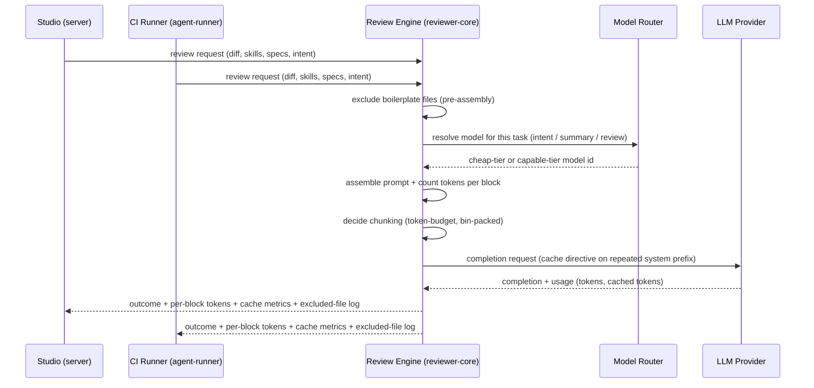
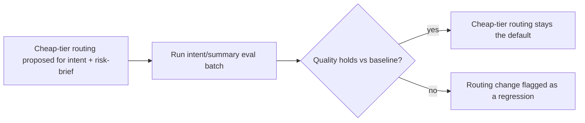

# Spec: Cost Surgery — Backend/Engine

**Spec ID:** SPEC-2026-07-11-cost-surgery-backend
**Status:** approved
**Date:** 2026-07-11
**Affects:** server / reviewer-core / agent-runner (backend & engine only — no client)
**Supersedes:** —

## 1. Problem & Motivation

DevDigest's review engine spends real LLM budget across three independent inefficiencies surfaced by a cost audit of the last seven weeks of usage. First, there is no visibility into where the tokens go: the prompt sent to a model is built from several distinct blocks (system instructions, skills, project-context specs, caller digests, the diff itself), but only whole-prompt or whole-document token counts exist today — nobody can point at a number and say "the specs block is the expensive part." Cache behavior is equally invisible: the engine already asks OpenRouter to report usage detail and the codebase contains an unused prompt-cache utility, but nothing captures or logs whether a repeated prompt prefix is actually served from cache versus silently repriced every time.

Second, two of the engine's lowest-stakes LLM calls do not consistently run on the cheap model tier that exists specifically for this purpose. Intent classification already routes to the cheap tier, but the PR risk-brief narrative — a summary-style generation, not the structured review itself — always resolves to the capable/flagship model regardless of the routing rule. Compounding this, a workspace-level "review intent" model picker is visible in the product's configuration surface, but no code path reads it: a user can change this control and nothing about the system's behavior changes.

Third, files that can never carry review-relevant risk (lock files, generated code, minified bundles, vendored dependencies) are only removed from the prompt when the diff already exceeds the target model's raw token budget. The common case — a diff that comfortably fits under budget but still contains a large, irrelevant lock-file diff — pays full price to send that content into every prompt block downstream (skills, specs, system instructions get resent alongside it). The map-reduce strategy that activates on large multi-file diffs makes this worse: it issues one LLM call per changed file with no regard for how small each file's diff actually is, resending the full system/skills preamble (tens of thousands of tokens) once per file instead of packing several small files into a shared call.

Underlying all three fixes is a measurement problem: nothing today grades whether an output that gets routed to a cheaper model (intent, risk-brief narrative) stays accurate, so any cost optimization here is unverifiable without a new regression signal. And because the review engine (`reviewer-core`) is shared, unmodified, between the local studio and a bundled CI runner (`agent-runner`) that executes inside a different repository's own GitHub Actions, every fix in this spec must behave identically — and be equally measurable — in both places; `agent-runner` today has no token counter at all and inherits the same fixed-threshold map-reduce behavior.

This spec defines the backend/engine changes needed to close these three gaps with measured numbers, backed by an automated quality regression guard. It produces **data** (per-block token counts, cache-hit metrics, exclusion logs, eval scores) — a separate, later spec (Spec B) turns that data into dashboards. This spec defines no UI.

## 2. Goals / Non-goals

**Goals:**
- Make per-prompt-block token cost measurable on every review run — system / skills / specs / diff split — in both the studio and CI.
- Make cache behavior observable on every run (was a repeated prefix actually served from cache?), and make cache reuse real for the system prefix repeated across a single map-reduce run's chunks.
- Route PR-intent classification and the risk-brief narrative generation to the cheap model tier by default, fix the currently-inert "review intent" model-override control so it governs real behavior, and guard the routing change with an automated regression eval.
- Exclude files mechanically classified as boilerplate (lock files, generated/minified/snapshot files, vendored paths) from the prompt entirely, before assembly — not only once the diff already exceeds a token budget — with an honest, always-present exclusion log.
- Replace the fixed line-count-and-file-count map-reduce threshold with a token-count threshold, and let the chunker pack several small files into one shared call instead of always issuing one call per file.
- Build a new evaluation capability that scores intent-classification and risk-brief-narrative quality, so every cheap-tier routing change ships with a measurable pass/fail regression guard.
- Reach parity in `agent-runner` (CI) for token counting, boilerplate exclusion, and token-budget map-reduce chunking, since CI reviews today have none of these three capabilities.

**Non-goals:**
- Any UI — no Agent Performance dashboard, no Agent/Skill Stats tab, no charts, no cost-delta or cost-per-category visualization, no "Most-Pulled Memory" panel. That work is Spec B, produced in a separate session, consuming the data this spec defines.
- Building a new billing-analytics integration against the OpenRouter dashboard API. The manual "read the 7-week bill" exercise that motivated this spec is satisfied, in-product, by the per-run/per-block instrumentation defined here — not by a new external billing integration.
- Changing which model performs the primary structured review call. Cheap-tier routing in this spec applies only to intent classification and the risk-brief narrative; the review call's model resolution is unchanged.
- A new persistent token/cache/exclusion analytics table or warehouse. These facts are captured per run, alongside the existing run-trace and eval-batch storage; no new aggregation store is introduced.
- Building a new caching layer. This spec sends an existing provider's cache directive and captures what the provider reports back; it does not add a new in-process cache beyond what already exists (unused) in the codebase.
- Changing the existing over-budget diff-trimming behavior (the current core → wiring → boilerplate greedy pack that runs only when a diff exceeds budget). The new unconditional boilerplate exclusion (workstream 4) runs as an earlier, independent step — it does not replace or alter that existing trim.
- A per-agent-configurable map-reduce token threshold. A single, centrally shared default threshold is in scope; agent-level overrides of that threshold are not.
- Multi-agent fan-out cost accounting or cross-agent cost comparison. This spec instruments a single run at a time.

## 3. User Stories

- As a DevDigest maintainer, I want to see a run's prompt-block token split (system / skills / specs / diff), so that I can name the top cost contributors with real numbers instead of guessing.
- As a DevDigest maintainer, I want to know whether a run's repeated prompt prefix was actually served from cache, so that I can tell a silent cache miss apart from a genuine cache hit.
- As a DevDigest maintainer, I want intent classification and the risk-brief narrative to run on the cheap model tier by default, so routine, low-stakes calls stop paying flagship prices.
- As a DevDigest maintainer, I want an automated eval that fails loudly if cheap-tier routing degrades intent or risk-brief quality, so that a cost optimization is a measured decision, not a lottery.
- As a DevDigest maintainer, I want boilerplate files (lock files, generated code, minified bundles) excluded from every review prompt before assembly, so a mega-PR that happens to touch a lock file doesn't burn tokens "reviewing" it.
- As a DevDigest maintainer, I want map-reduce chunking to pack the diff by token budget rather than a fixed line-count-and-file-count rule, so reviewing many small files doesn't multiply the system preamble once per file.
- As a DevDigest maintainer, I want the same boilerplate filter and token-aware chunking to apply when a review runs inside a target repo's CI, so CI-driven reviews get the same cost discipline as studio reviews.

## 4. Workflow & Module Communication

The review engine is one shared component consumed by two independent callers (the studio's run executor and the CI runner). All five workstreams live inside that shared path, so both callers get the same behavior for the same diff:

Cheap-tier routing (workstream 3) is gated by the new eval capability (workstream 6) before it is trusted as a default:

## 5. Acceptance Criteria (EARS)

### Workstream 1 — Cost & token instrumentation

- **AC-1** (Event-driven): WHEN a review run completes, in the studio or in CI, the system SHALL record the token count of each prompt block included in the assembled prompt (system, skills, specs/project-context, callers, repo map, PR description, and diff/user content) as separate values, not folded into one combined total.
- **AC-2** (Event-driven): WHEN a review run uses map-reduce chunking, the system SHALL record token counts that make the map-reduce repeat overhead visible — at minimum, the shared/system portion counted once plus each chunk's diff portion — rather than folding all chunks into a single run-level total.
- **AC-3** (Ubiquitous): The system SHALL make every run's total input tokens, output tokens, and cost (USD) attributable to a specific PR, agent, and model — sufficient to rank the top-3 cost items across a multi-week window by model and by session without manual log inspection.
- **AC-4** (Unwanted behavior): IF per-block token counting fails for a given block, THEN the system SHALL record that block's count as unavailable — not zero, not silently omitted — and SHALL continue completing the review; a counting failure SHALL NOT fail or degrade the review itself.
- **AC-5** (Ubiquitous): The system SHALL compute per-block and per-run token counts using the same counting method whether the review executes in the studio or inside CI, so reported counts from the two environments are directly comparable.

### Workstream 2 — Cache visibility + cache directive

- **AC-6** (Event-driven): WHEN a review run's LLM provider reports a cache-related usage metric (e.g. cached/reused input tokens) for a completion, the system SHALL capture and persist that value on the run's record, separate from the total input token count.
- **AC-7** (Unwanted behavior): IF a provider reports zero cached tokens for a completion whose prompt shares an identical prefix with a prior completion in the same run, THEN the system SHALL surface this as an observable cache miss in the run's data, distinguishable from "the provider does not report a cache metric at all."
- **AC-8** (State-driven): WHILE a map-reduce run issues multiple completions that share an identical system-message prefix across chunks, the system SHALL mark that shared prefix as cacheable to providers that support an explicit cache-control mechanism.
- **AC-9** (Ubiquitous): The system SHALL apply the cache-control marking as additive metadata only — the semantic content of the prompt sent to the model SHALL be unchanged by the marking.
- **AC-10** (Unwanted behavior): IF the LLM provider for a given run does not support the cache-control mechanism, THEN the system SHALL send the request unchanged and SHALL NOT fail or degrade the run.

### Workstream 3 — Cheap-tier routing (incl. the review-intent override fix)

- **AC-11** (Ubiquitous): The system SHALL route PR-intent classification to the cheap model tier by default, unless a workspace-level override for that specific task is configured.
- **AC-12** (Event-driven): WHEN the risk-brief narrative is generated for a PR, the system SHALL route that generation to the cheap model tier by default, unless a workspace-level override for that specific task is configured — the risk brief SHALL NOT continue to resolve unconditionally to the capable/flagship model tier regardless of routing rules.
- **AC-13** (Unwanted behavior): IF a workspace has configured a review-intent model override, THEN the system SHALL apply that override when resolving the model used for intent classification — a configuration control visible to the user SHALL affect the model actually used.
- **AC-14** (Ubiquitous): The system SHALL apply cheap-tier default routing to intent classification and risk-brief generation only; the primary structured review call's model resolution SHALL remain unaffected by this spec.

### Workstream 4 — Boilerplate filter (incl. CI reach)

- **AC-15** (Event-driven): WHEN a review's diff is assembled into a prompt, the system SHALL exclude every file mechanically classified as boilerplate (lock files, generated/minified/snapshot files, vendored/dependency paths) from the content sent to the model, regardless of whether the diff is under or over the model's token budget.
- **AC-16** (Event-driven): WHEN one or more files are excluded as boilerplate from a run, the system SHALL log a structured event naming the excluded files, their count, and the estimated tokens avoided by their exclusion.
- **AC-17** (Ubiquitous): The system SHALL emit the boilerplate-exclusion report on every review run, including a zero-count report when no files were excluded — exclusion visibility SHALL never depend on anything having actually been excluded.
- **AC-18** (Unwanted behavior): IF a file's path matches a wiring pattern such as a Dockerfile, a GitHub Actions workflow file, or an environment-variable example file, THEN the system SHALL NOT classify it as boilerplate and SHALL include it in the reviewed content.
- **AC-19** (Ubiquitous): The system SHALL apply the same boilerplate-exclusion rule, before prompt assembly, whether a review executes inside CI or in the studio.
- **AC-20** (Ubiquitous): The system SHALL measure and record, for at least one designated large multi-file diff containing a lock-file change, the input-token count before and after boilerplate exclusion is applied, so the reduction is backed by a recorded number rather than an assumed percentage.

### Workstream 5 — Map-reduce token-budget + bin-packing (incl. CI reach)

- **AC-21** (Event-driven): WHEN a review's diff requires a map-reduce chunking decision, the system SHALL base that decision on a token-count threshold rather than the current fixed line-count-and-file-count rule.
- **AC-22** (Event-driven): WHEN multiple changed files are each individually small relative to the token threshold, the system SHALL group them into shared chunks up to that threshold rather than issuing one LLM call per file.
- **AC-23** (Ubiquitous): The system SHALL use the same token-count threshold value in the studio and in CI — not two independently maintained constants.
- **AC-24** (Ubiquitous): The system SHALL make a token counter available to CI review execution so the same token-budget chunking decision can be applied there as in the studio.
- **AC-25** (Unwanted behavior): IF a single file's diff alone exceeds the token threshold, THEN the system SHALL still send that file as its own chunk rather than silently dropping it for exceeding the bin-pack limit.

### Workstream 6 — Intent/summary eval regression capability

- **AC-26** (Ubiquitous): The system SHALL provide a way to define an evaluation case whose expectation is an intent-classification outcome for a given PR/diff context, scored independently of the existing review-findings eval cases.
- **AC-27** (Ubiquitous): The system SHALL provide a way to define an evaluation case whose expectation is a risk-brief-narrative quality outcome for a given PR context, scored independently of the existing review-findings eval cases.
- **AC-28** (Event-driven): WHEN an intent or risk-brief-narrative eval case is run, the system SHALL produce a deterministic pass/fail (or scored) result derived from comparing the actual output against the case's stored expectation — not an unscored raw transcript.
- **AC-29** (Ubiquitous): The system SHALL allow an intent/summary eval batch to be run against the cheap-tier-routed model and report whether quality held relative to the case's expectation — this is the regression signal that gates workstream 3's routing change.
- **AC-30** (Unwanted behavior): IF an intent/summary eval batch scores below its case's defined passing threshold after a routing change, THEN the system SHALL surface that batch/case as failed — a quality regression SHALL be visible, not silently absorbed into an aggregate that still reads "passing."

## 6. Edge Cases

| Case | Expected behavior | Covered by |
|---|---|---|
| Token counting throws on one prompt block mid-run | Block recorded as unavailable; run completes normally | AC-4 |
| Same diff reviewed once in the studio and once via CI | Reported token counts match — same counting method | AC-5 |
| Provider response omits any cache field entirely | Distinguished from a reported zero — "unsupported/unreported" is never conflated with "cache miss" | AC-6, AC-7 |
| A run with only a single-pass completion (no repeated prefix at all) | No cache-control marking is needed or applied — nothing to reuse within the run | AC-8 |
| Workspace has not configured any review-intent override | Cheap-tier default applies to intent classification | AC-11 |
| Workspace has an active review-intent override already set | Override is honored when resolving the intent model | AC-13 |
| A changed `.env.example` file in the diff | Included in reviewed content, not excluded as boilerplate | AC-18 |
| A changed `Dockerfile` or `.github/workflows/*.yml` file | Included in reviewed content, not excluded as boilerplate | AC-18 |
| A diff containing zero boilerplate files | Zero-count exclusion event still emitted | AC-17 |
| A mega-PR whose only large file is a lock file | Lock file excluded before assembly; before/after token counts both recorded | AC-15, AC-20 |
| A diff with many small files, none individually over the token threshold | Files bin-packed into shared chunks, not one LLM call per file | AC-22 |
| A diff with one file whose own diff exceeds the token threshold | That file still gets its own chunk | AC-25 |
| An intent/summary eval batch run against the pre-change (capable-tier) baseline | Establishes the quality baseline the cheap-tier run is compared against | AC-29 |
| An intent/summary eval batch that regresses after switching to cheap tier | Failure is visible per-batch/per-case, not averaged away | AC-30 |

## 7. Non-functional

- WHERE token counting, cache-metric capture, and boilerplate classification run inside the review engine, the system SHALL implement them as pure, injected-dependency functions with zero DB access, zero file I/O, and zero direct environment-variable reads — verify: the engine's existing hermetic test suite (stubbed LLM provider, no network) continues to pass unmodified for these additions.
- The system SHALL continue to resolve all server-side secrets exclusively through the existing secrets-provider mechanism; this spec introduces no new secret and no new direct environment-variable read for a credential outside the CI runner's already-documented exception — verify: code review confirms no new direct secret read outside that exception.
- The system SHALL NOT require editing any already-applied database migration; any newly persisted field (per-block tokens, cache metrics, exclusion counts, new eval case data) SHALL be additive to existing document storage or delivered via a new, forward-only migration — verify: migration directory diff contains only new files.
- WHEN token counting and cache-metric capture run as part of every review, the system SHALL add no network round-trip beyond the review's existing LLM calls — counting and classification SHALL be local, synchronous computations — verify: no new outbound HTTP call is introduced by this instrumentation.
- The system SHALL produce identical boilerplate-exclusion and token-budget-chunking outcomes for an identical diff whether the review executes in the studio or inside CI — verify: a shared fixture diff run through both call paths yields matching excluded-file lists and matching chunk counts.
- Any new data this spec persists that is queryable per workspace (e.g. new eval case data) SHALL remain workspace-scoped, consistent with the project's existing data-isolation convention — verify: code review confirms workspace-scoping on any new query.

## 8. Inputs (Provenance)

| Input | Provenance |
|---|---|
| PR diff (files, hunks) | [reused: L01] |
| File boilerplate / core / wiring classification | [deterministic: repo-intel] — existing L03 mechanical classification, zero LLM calls |
| Per-prompt-block token counts | [deterministic: repo-intel] — mechanical counting over already-assembled prompt text, zero LLM calls |
| LLM provider usage + cache metrics | [reused: L01] — fields already returned in the provider's completion response; newly captured and persisted, not newly requested |
| Intent classification result | [reused: L04] — existing cheap-tier-eligible LLM call; this spec changes routing/measurement, not the call itself |
| Risk-brief narrative result | [reused: L04] — existing structured LLM call; this spec changes routing/measurement, not the call itself |
| Intent/summary eval case run | [reused: L04/L06] — reuses the same intent/risk-brief LLM call the batch grades; this spec introduces zero new LLM call types |
| Intent/summary eval scoring | [deterministic: repo-intel] — mechanical comparison of the actual output against the case's stored expectation, zero LLM calls |

No `[new: N LLM call]` inputs are introduced by this spec — every workstream instruments, routes, filters, or grades an LLM call that already exists in the pipeline; none of the five workstreams adds a new call site.

## 9. Contracts

**Per-run cost/cache/exclusion data** (additive to the existing run record):

| Field | Type (conceptual) | Meaning | Null means |
|---|---|---|---|
| block_token_counts | list of (block name, token count) pairs | Per-slot token counts for the assembled prompt (system, skills, specs, callers, repo_map, pr_description, diff/user) | A block missing from the list means that slot was not part of this run's prompt |
| block_token_counts[i].tokens | integer, or an "unavailable" marker | Token count for that block; the marker is used when counting failed for that block | N/A — the marker itself communicates the failure |
| cached_input_tokens | integer, nullable | Tokens the provider reported as served from cache across this run's completions | Null means the provider reported no cache metric at all (distinct from a reported zero) |
| cache_control_applied | boolean | Whether this run's repeated system prefix was marked eligible for provider-side caching | False when the provider doesn't support it, or the run had no repeated prefix to mark |
| excluded_boilerplate_files | list of file paths | The files excluded from the prompt as boilerplate before assembly | Empty list means nothing was excluded (always present, never omitted) |
| excluded_boilerplate_tokens | integer | Estimated tokens avoided by that exclusion | 0 when nothing was excluded |
| map_reduce_threshold_tokens | integer | The token threshold used to decide/chunk this run's map-reduce split | N/A — always present when map-reduce mode is used |
| map_reduce_chunk_count | integer | Number of LLM calls issued for this run's chunking | 1 for a single-pass run |

**Intent/summary eval case** (a new case kind alongside the existing review-findings case kind):

| Field | Type (conceptual) | Meaning | Null means |
|---|---|---|---|
| eval_case_kind | enum: review_finding \| intent \| risk_brief_narrative | Distinguishes which pipeline output this case grades | N/A |
| expected_intent_summary | text | Reference intent/scope statement the actual intent output is compared against; present only for intent-kind cases | Not applicable for non-intent case kinds |
| expected_risk_brief_keypoints | list of text | Reference key points the actual risk-brief narrative must cover; present only for narrative-kind cases | Not applicable for non-narrative case kinds |
| case_result_status | enum: passed \| failed \| error | Deterministic outcome of comparing actual vs. expected output for one case run | N/A |

## 10. Untrusted Inputs

This spec's boilerplate classification reads file **paths** from the PR diff (author-controlled, not reviewer-controlled) to decide prompt inclusion; paths are compared mechanically against pattern lists and are never interpreted as instructions. This decision does not bypass or alter the engine's existing handling of diff **content** (delimiter-wrapping plus the injection guard), which is unchanged by this spec. Per-block token counting reads the same already-untrusted diff/spec/PR-description text the pipeline already wraps as untrusted, purely to count tokens — it does not interpret or execute that text. No new class of untrusted input is introduced by this spec.

## 11. Risks

- The new intent/summary eval capability is net-new — no prior mechanism grades these outputs. An uncalibrated scoring threshold could mask a real regression (false pass) or block a legitimate cheap-tier routing change (false fail). Mitigation: run the new eval batch against the current (capable-tier) outputs first to establish a baseline before the routing change ships.
- Routing the risk-brief narrative to a cheaper model changes user-facing content, not just an internal log — the risk brief is shown to end users elsewhere in the product. A quality regression here is user-visible, and the eval gate (workstream 6) is only as good as its case coverage.
- The review engine is consumed unmodified by both the studio and the CI runner (which ships into a different repository's own Actions pipeline). A change to token counting, boilerplate exclusion, or map-reduce chunking inside the shared engine affects both consumers at once — this is not a server-only change, and the CI runner's own test/typecheck cadence can lag the server's.
- Sending an explicit cache directive is provider-specific — it is confirmed available on one direct-provider adapter path. A routed/proxying provider path may forward to many different underlying models with inconsistent cache support; that path may gain cache **visibility** (workstream 2's logging) without gaining cache **savings**.
- Unconditionally excluding boilerplate files before prompt assembly is a behavior change from today's "only trim when over budget" model: a boilerplate file that would previously have been sent whole (because the diff fit under budget) will now never reach the model, even in the rare case a reviewer specifically wanted that content reviewed. This is a deliberate tradeoff, not an oversight, but it is a visible behavior change worth calling out.

## 12. Measurement Acceptance

Ties each self-check item from the lab task to the acceptance criteria that satisfy it:

| Self-check item | Satisfied by |
|---|---|
| Top-3 cost items nameable with real numbers | AC-3 |
| Per-run prompt-block token split (system / skills / specs / diff) visible | AC-1, AC-2 |
| Silent cache miss is detectable, not indistinguishable from "no cache support" | AC-6, AC-7 |
| Intent + risk-brief narrative run on the cheap tier by default | AC-11, AC-12 |
| Evals confirm no quality regression from cheap-tier routing | AC-26–AC-30 |
| Dead review-intent override control now governs real behavior | AC-13 |
| Boilerplate filter gives a measured reduction on a mega-PR, with a recorded before/after | AC-15, AC-16, AC-20 |
| Map-reduce ×7–10 trap addressed: token-budget threshold + bin-packing replace the file-count/line default | AC-21, AC-22, AC-23, AC-25 |
| Boilerplate filter and token-budget map-reduce both reach CI | AC-19, AC-24 |
| Real cache savings targeted on the repeated system prefix within one map-reduce run | AC-8, AC-9, AC-10 |

## 13. Clarifications (resolved 2026-07-11)

**Resolved 2026-07-11 (user):** all three confirmed as the stated defaults — (1) **deterministic/mechanical** eval scoring (no LLM-judge, preserving the zero-new-LLM-call property), (2) **wire** the dead review-intent control (backend-only, AC-13), (3) **per-case editable** passing threshold (skill-eval convention). The spec is `approved`.

Each item below states the assumption (now confirmed) for the implementation-planner's reference.

- **Intent/summary eval scoring methodology.** Two existing precedents in this codebase pull in different directions: the review-findings eval pipeline scores deterministically (zero LLM calls); the skill-eval pipeline uses a two-tier deterministic-gate-plus-LLM-judge approach. This spec **assumes deterministic, mechanical comparison** (e.g. required-field/key-point coverage, in-scope/out-of-scope set matching) for AC-26–AC-28, to preserve the "zero new LLM call sites" property called out in section 8 — an LLM-judge approach would introduce a new call site that needs its own provenance justification and materially changes this cost-reduction feature's own cost profile. Confirm this choice before implementation, since it changes both the Inputs table and the Non-functional cost claim.
- **Resolution for the dead review-intent control.** The lab's recommendation allows either "wire it" or "remove it." Since this spec is backend/engine-only (no client work), it **assumes "wire it"** (AC-13) — a pure backend fix — rather than "remove it," which would require a client-side change out of this spec's scope. Confirm this is the intended resolution; if removal is preferred instead, that work belongs in Spec B (client) or a follow-up, not here.
- **Passing-threshold mechanics for the new eval case kind.** This spec **assumes** the new intent/risk-brief-narrative case kind reuses the existing per-case, editable-threshold convention (as established for skill evals) rather than introducing a single global pass/fail bar. Confirm this is acceptable, since it affects how AC-30's "defined passing threshold" is configured.
