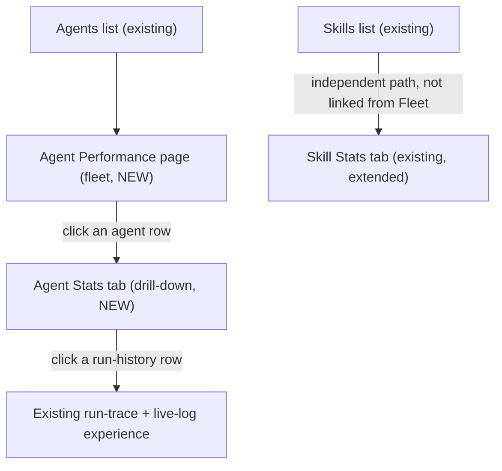
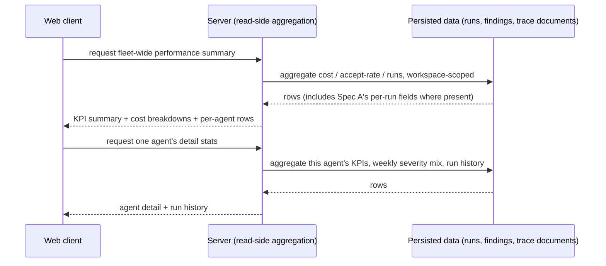

# Spec: Cost Surgery — UI/Dashboards

**Spec ID:** SPEC-2026-07-11-cost-surgery-ui
**Status:** implemented <!-- approved 2026-07-11; implemented + verified 2026-07-12 via docs/plans/2026-07-12-cost-surgery-ui-plan.md (29/29 ACs signed off; AC-25 per-block-token display formally descoped) -->
**Date:** 2026-07-11
**Affects:** full-stack (client-primary; one small, read-only server addition)
**Supersedes:** —

## 1. Problem & Motivation

A cost audit of DevDigest's review engine (Spec A, approved) produces new, precise numbers — per-prompt-block token splits, cache behavior, boilerplate-exclusion savings, cost-by-model — but none of it is visible anywhere in the product today. A maintainer who wants to see where the engine's budget goes, or confirm that a cost-saving change actually reduced spend, still has to read the raw OpenRouter bill by hand.

Three UI surfaces already exist in different states of readiness. A workspace-wide "Agent Performance" page is scaffolded — its translation strings are fully drafted (KPI summary, cost-by-agent, cost-by-model, a sortable table, an empty state) but no component consumes them, and the page has no navigation entry or route. A per-agent "Stats" tab is reserved on the Agent editor — its label is already reserved in the tab strip's source translations, and a rich per-agent detail shape is already fully defined server-side, but the read it would come from was never wired to a route. A per-skill "Stats" tab is live and already shows real usage data, but its findings-by-category breakdown is a raw count (there is no per-finding cost anywhere in the system) and its accept-rate is a hardcoded placeholder that has never reflected reality, even though the join it needs already exists and is used elsewhere in the product.

This spec activates all three surfaces so a maintainer can see, in-product, exactly which agents and skills are driving cost and quality — closing the loop Spec A's backend work opened.

## 2. Goals / Non-goals

**Goals:**
- Activate the Agent Performance page end-to-end: a workspace-wide KPI summary, a cost-by-agent and a cost-by-model breakdown, and a sortable per-agent table — reachable from primary navigation.
- Build the reserved Agent Stats tab end-to-end: the agent's existing detail metrics plus a weekly findings-by-severity breakdown, a most-used-skills panel, a most-pulled-memory panel, and a run-history list for that agent.
- Convert the Skill Stats tab's findings-by-category breakdown from a raw count to an estimated dollar amount, and replace its permanently-zero accept-rate with a real, computed value.
- Give every new run-history list a drill-down into the same run-trace-and-live-log experience the product already uses elsewhere, so there is one consistent way to inspect a run regardless of which screen surfaced it.
- Consume Spec A's newly produced data (per-block tokens, excluded-boilerplate tokens, cost-by-model) wherever these three surfaces display it, without re-deriving or duplicating that computation.

**Non-goals:**
- No new billing-analytics integration against an external provider's dashboard API.
- No cross-workspace comparison — every view here is scoped to the requesting workspace.
- No CSV or other data export of performance data.
- No alerting or notifications on cost or performance thresholds.
- No per-user dashboard customization (pinning, reordering, or hiding widgets).
- No backfill of historical run rows for any new field this spec reads — an older run simply shows that field as unavailable, never recomputed.
- No changes to the review engine or the CI runner — this spec is pure read-side aggregation over already-persisted data plus Spec A's new fields.
- No unified studio-and-CI run history. CI-executed runs are excluded from every run-history list, run count, and cost aggregate this spec introduces; they remain visible exclusively on the existing, separate CI Runs page. (CI-ingested run records carry no token data and no linked trace document today, so a combined list would either be inconsistent — some rows drillable, some not — or require faking data that doesn't exist.)
- No real instrumentation of actual per-run skill usage. The most-used-skills panel ships as a labeled approximation; building the real per-run tracking is a follow-up, not part of this spec.
- No real instrumentation of memory-pull tracking. The most-pulled-memory panel ships as an honest empty state; today's engine does not record which memory items a run actually used, regardless of embeddings configuration.
- No new persisted cost-baseline or snapshot table, and no new migration. Every cost delta this spec displays is computed live, at read time, by comparing two trailing windows of already-persisted data.
- No change to the existing lightweight per-agent rollup that powers the Agents list page today — it keeps its current shape and its current five fields unchanged; the richer fleet-level data this spec needs is a separate, new read.
- No click-to-filter or drill-down interaction on the cost-by-agent/cost-by-model breakdowns beyond what is explicitly specified — they are visual summaries, not interactive filters.

## 3. User Stories

- As a DevDigest maintainer, I want a fleet-wide view of every agent's cost, accept-rate, and run activity, so I can see where Spec A's savings are landing without reading the provider's bill by hand.
- As a DevDigest maintainer, I want to drill from the fleet view into one agent's detailed stats — trend, weekly severity mix, most-used skills, run history — so I can investigate a specific agent after spotting something on the fleet page.
- As a DevDigest maintainer, I want a skill's findings-by-category breakdown priced in estimated dollars instead of raw counts, so I can see which category of finding costs the most to produce.
- As a DevDigest maintainer, I want a real accept-rate on the Skill Stats tab instead of an always-zero placeholder, so the number I'm looking at is trustworthy.
- As a DevDigest maintainer, I want to open the same run-trace-and-live-log view I already use elsewhere from any new run-history list, so I don't have to learn a second way to inspect a run.

## 4. Workflow & Module Communication

Navigation across the three surfaces — the fleet page is the entry point into an agent's drill-down; the skill surface is reached independently:

Data flow for the two new/extended reads this spec needs (interface-level — see Section 9 for field shapes):

## 5. Acceptance Criteria (EARS)

### Agent Performance page (fleet)

- **AC-1** (Event-driven): WHEN the maintainer opens the Agent Performance page, the system SHALL display a workspace-wide KPI summary consisting of: all-time total runs, trailing-30-day total cost together with its signed delta against the prior 30-day window, a trailing-30-day blended accept-rate, and the most-active agent by trailing-30-day run count.
- **AC-2** (Event-driven): WHEN the Agent Performance page loads, the system SHALL display a cost-by-agent breakdown and a cost-by-model breakdown, both scoped to the trailing 30 days.
- **AC-3** (Ubiquitous): The system SHALL include one row per agent in the workspace on the Agent Performance table, including agents with zero runs — for a zero-run agent, runs/findings/cost SHALL display as 0 and accept-rate SHALL display as unavailable, not as 0%.
- **AC-4** (Event-driven): WHEN the maintainer selects a sort dimension (accept-rate, runs, or cost) on the Agent Performance table, the system SHALL reorder the table rows by that dimension without an additional network request.
- **AC-5** (Event-driven): WHEN the maintainer clicks an agent's row on the Agent Performance table, the system SHALL navigate to that agent's Stats tab.
- **AC-6** (Ubiquitous): The system SHALL make the Agent Performance page reachable from the workspace's primary navigation.
- **AC-7** (Unwanted behavior): IF no agent in the workspace has any recorded run, THEN the system SHALL display the page's empty state instead of the KPI summary and table.
- **AC-8** (Unwanted behavior): IF the Agent Performance data fails to load, THEN the system SHALL display a load-error message in place of the page content, with no retry control.
- **AC-9** (State-driven): WHILE the Agent Performance data is loading, the system SHALL display skeleton placeholders for the KPI summary and the table.

### Agent Stats tab (drill-down)

- **AC-10** (Event-driven): WHEN the maintainer opens an agent's Stats tab, the system SHALL display that agent's runs, findings totals, accepted/dismissed/pending counts, accept-rate as a ring/radial gauge, dismiss-rate, average findings per run, total cost, average cost, and average latency.
- **AC-11** (Event-driven): WHEN the Agent Stats tab loads, the system SHALL display a trailing-30-day cost delta against the prior 30-day window, alongside the agent's total cost.
- **AC-12** (Event-driven): WHEN the Agent Stats tab loads, the system SHALL display the agent's findings-by-severity as a weekly, severity-color-coded stacked bar covering the trailing 8 weeks, in addition to the existing all-time severity totals.
- **AC-13** (Event-driven): WHEN the Agent Stats tab loads, the system SHALL display the agent's most-used skills as a ranked list, visually labeled as an approximation.
- **AC-14** (Event-driven): WHEN the Agent Stats tab loads, the system SHALL display a most-pulled-memory panel; WHERE no memory pulls are recorded for the agent, the system SHALL render that panel's dedicated empty state rather than an empty chart.
- **AC-15** (Event-driven): WHEN the Agent Stats tab loads, the system SHALL display a run-history list for that agent, sourced only from studio-executed runs.
- **AC-16** (Event-driven): WHEN the maintainer clicks a row in an agent's run-history list, the system SHALL open the same run-trace-and-live-log experience already used elsewhere in the product for that run (Configuration / Stats / Prompt assembly / Tool calls / Raw output, plus a live log).
- **AC-17** (Unwanted behavior): IF an agent has zero runs ever, THEN the Agent Stats tab SHALL display a dedicated "no runs yet" empty state instead of charts populated with zero values.
- **AC-18** (Unwanted behavior): IF the Agent Stats data fails to load, THEN the system SHALL display a load-error message with no retry control.
- **AC-19** (State-driven): WHILE the Agent Stats data is loading, the system SHALL display skeleton placeholders.

### Skill Stats tab (existing surface, extended)

- **AC-20** (Event-driven): WHEN the Skill Stats tab loads, the system SHALL display the findings-by-category breakdown as an estimated dollar amount per category, computed from the same trailing-30-day finding set already used for that breakdown, instead of a raw count.
- **AC-21** (Ubiquitous): The system SHALL visually mark the findings-by-category dollar breakdown as an estimate, distinguishable from non-estimated values on the same tab.
- **AC-22** (Event-driven): WHEN the Skill Stats tab loads, the system SHALL display a real accept-rate for the skill, computed over the same trailing-30-day window and agent set already used for the findings breakdown, replacing the previously always-zero value.
- **AC-23** (Unwanted behavior): IF a skill has zero findings in the trailing 30 days, THEN its findings-by-category panel SHALL show the existing empty state, unchanged from today's count-based behavior.

### Cross-cutting

- **AC-24** (Ubiquitous): The system SHALL scope every new read this spec introduces to the requesting user's workspace, consistent with the project's existing data-isolation convention.
- **AC-25** (Unwanted behavior): IF a per-run value this spec displays (for example, a Spec A per-block token count) is unavailable for an older run that predates that field, THEN the system SHALL display that value as unavailable, never as a fabricated 0.
- **AC-26** (Ubiquitous): The system SHALL exclude CI-executed runs from every run-history list, run count, and cost aggregate this spec introduces.
- **AC-27** (Unwanted behavior): IF the prior 30-day window used for a cost-delta computation has zero recorded runs, THEN the system SHALL treat that window as a legitimate zero-cost baseline, not as unavailable data.
- **AC-28** (Unwanted behavior): IF every run contributing to a cost-per-category, cost-by-agent, or cost-by-model estimate has an unknown (never-recorded) cost, THEN the system SHALL display that estimate as unavailable rather than as $0.00.
- **AC-29** (Ubiquitous): The system SHALL include a deleted agent's historical runs in the workspace-wide total-cost KPI while excluding them from any per-agent breakdown, since there is no agent left to attribute them to.

## 6. Edge Cases

| Case | Expected behavior | Covered by |
|---|---|---|
| Workspace has zero agents with any recorded run | Fleet page empty state shown | AC-7 |
| An agent exists but has zero runs ever | Fleet table still shows its row (0/0/0, accept-rate unavailable); its Stats tab shows a dedicated "no runs yet" empty state | AC-3, AC-17 |
| Fleet or Agent Stats data fails to load | Load-error message shown, no retry control | AC-8, AC-18 |
| Maintainer changes the fleet table's sort control | Rows reorder client-side, no network request | AC-4 |
| Maintainer clicks a fleet table row | Navigates to that agent's Stats tab | AC-5 |
| Maintainer clicks a run-history row | Opens the existing run-trace-and-live-log experience for that run | AC-16 |
| An older run predates a Spec A field (e.g. per-block tokens) | Shown as unavailable, never as 0 | AC-25 |
| A CI-executed run exists for an agent | Excluded from this spec's run-history/run-count/cost views; remains visible only on the existing CI Runs page | AC-26 |
| The prior 30-day window has zero runs | Cost delta equals the current window's total (a legitimate $0 baseline, not "unavailable") | AC-27 |
| Every run behind a cost estimate has an unknown (never-recorded) cost | Estimate shown as unavailable, not $0.00 | AC-28 |
| A skill has zero findings in the trailing 30 days | Existing empty state carries over unchanged, now on the dollar-denominated panel | AC-23 |
| An agent is deleted after producing runs | Its historical runs still count toward the workspace-wide total-cost KPI; excluded from per-agent breakdowns | AC-29 |
| An agent has zero recorded memory pulls | Most-Pulled-Memory panel shows its dedicated empty state | AC-14 |
| An agent has zero linked skills | Most-used-skills panel renders an empty list, not an error | AC-13 |

## 7. Non-functional

- The system SHALL scope every new read this spec introduces to the requesting workspace, consistent with the project's existing data-isolation convention — verify: code review confirms workspace-scoping on every new query.
- The system SHALL compute every aggregate this spec introduces (cost-by-agent, cost-by-model, the cost-per-category estimate, accept-rates, the weekly severity breakdown, and every cost delta) via pure, mechanical aggregation over already-persisted data — zero LLM calls — verify: no new LLM call site is introduced by this spec.
- WHEN the Agent Performance page loads for a workspace with a typical fleet size (on the order of tens of agents), the system SHALL render the KPI summary and table within 2 seconds (p95) — verify: browser performance trace against seeded demo data.
- Every value this spec marks as an approximation or estimate (the cost-per-category breakdown, the most-used-skills ranking) SHALL carry a visual label or tooltip distinguishing it from exact values shown on the same screen — verify: design/code review confirms the distinction is actually rendered, not only documented.
- The new ring/radial gauge and weekly stacked-bar visuals SHALL expose their headline numeric value to assistive technology, not only as a visual shape — verify: automated accessibility scan plus a manual screen-reader spot check.

## 8. Inputs (Provenance)

| Input | Provenance |
|---|---|
| Agent run records (cost, tokens, status, timestamp, model, owning agent) | [reused: L01] |
| Findings and their accept/dismiss actions | [reused: L01] |
| Agent and skill configuration, including which skills are linked to which agent | [reused: L02] |
| Per-block token counts, cache metrics, excluded-boilerplate tokens, and cost-by-model data | [reused: SPEC-2026-07-11-cost-surgery-backend] |
| The existing lightweight per-agent rollup used by the Agents list page | [reused: L02] — unchanged by this spec |
| The existing, fully-defined-but-never-routed richer per-agent detail shape | [reused: L07] — this spec wires and extends it |
| Cost-per-category estimate (even split of contributing-run cost by that category's share of the trailing-30-day finding count) | [deterministic: repo-intel] — mechanical aggregation, zero LLM calls |
| Trailing-30-day cost delta (live two-window comparison) | [deterministic: repo-intel] — mechanical aggregation, zero LLM calls |
| Most-used-skills approximation (an agent's linked skills weighted against its run volume) | [deterministic: repo-intel] — mechanical aggregation, zero LLM calls |
| Most-pulled-memory panel | [deterministic: repo-intel] — reads the existing, currently always-empty memory-pull record; renders the panel's empty state when nothing is recorded |

No `[new: N LLM call]` inputs are introduced by this spec — every value displayed is either reused verbatim from an existing record, reused from Spec A's new fields, or computed by mechanical aggregation with zero LLM calls, consistent with Spec A's own zero-new-LLM-call property.

## 9. Contracts

**Fleet-wide Agent Performance read** (new; distinct from, and does not change, the existing lightweight per-agent rollup used by the Agents list page):

| Field | Type (conceptual) | Meaning | Null means |
|---|---|---|---|
| total_runs_all_time | integer | Lifetime run count across every agent in the workspace | N/A — always present, 0 if none |
| total_cost_usd_30d | number, nullable | Trailing-30-day total cost across every agent | Null when no run in the window has a known cost |
| cost_delta_usd_30d | number, nullable | Trailing-30-day total cost minus the same sum for the prior 30-day window | Null only when the current window itself has no cost data — a zero prior window is a legitimate $0 baseline (see AC-27), not null |
| avg_accept_rate_pct_30d | number, nullable | Blended accepted / (accepted + dismissed) across the whole workspace, trailing 30 days | Null when nothing was accepted or dismissed in the window |
| most_active_agent | object (agent identity + its trailing-30-day run count), nullable | The agent with the highest trailing-30-day run count | Null when no agent has any run in the window |
| cost_by_agent | list of (agent identity, cost) pairs | Trailing-30-day cost breakdown per agent | Empty list when there is nothing to show |
| cost_by_model | list of (model name, cost) pairs | Trailing-30-day cost breakdown per model | Empty list when there is nothing to show |
| agent_rows | list of per-agent summary rows | One row per agent in the workspace, including zero-run agents (accept-rate, run count, findings count, cost, and a short recent-cost trend for a sparkline) | An agent with zero runs still appears; its accept-rate is null |

**Per-agent Stats read** (reuses the existing, already-fully-defined-but-never-routed per-agent detail shape for its base metrics — runs, findings totals, accepted/dismissed/pending, accept-rate, dismiss-rate, average findings per run, total/average cost, average latency, findings-by-severity, and a recent trend — unchanged. The fields below are additive to that shape):

| Field | Type (conceptual) | Meaning | Null means |
|---|---|---|---|
| cost_delta_usd_30d | number, nullable | Same two-window definition as the fleet read, scoped to this one agent | Same null semantics as the fleet field |
| weekly_findings_by_severity | list of 8 weekly points, oldest to newest, each carrying a count per severity | Trailing-8-week findings-by-severity time series for this agent | A week with zero findings of a given severity is 0, not omitted |
| most_used_skills | list of (skill identity, usage estimate) pairs, approximate | Ranked approximation of this agent's most-used linked skills | Empty list when the agent has no linked skills |
| memory_pulled_summary | list, currently always empty | Most-pulled-memory ranking for this agent | Empty list today — renders the panel's dedicated empty state, since no workspace has real pull data yet |
| run_history | list of this agent's studio-executed runs (identity, timestamp, status, cost, findings count) | This agent's run history, excluding CI-executed runs | Empty list when the agent has never run in the studio |

**Skill Stats read** (existing shape; two fields change meaning or value, everything else is unchanged):

| Field | Type (conceptual) | Meaning | Null means |
|---|---|---|---|
| findings_by_category | list of (category, estimated cost) pairs — previously (category, count) | Trailing-30-day findings-by-category, now an estimated dollar amount (even split of contributing-run cost by that category's share of the finding count), visually marked as an estimate | A category whose contributing runs all have unknown cost is shown as unavailable, not $0.00 |
| accept_rate_pct | number | Real accept-rate over the same trailing-30-day window and agent set already used for findings_by_category | N/A — 0 is now a real, possible value, not a placeholder |

## 10. Untrusted Inputs

None. This spec displays only already-computed, already-persisted aggregates over internal, workspace-configured data (agent names, skill names, costs, counts, timestamps) that the product already renders elsewhere. It introduces no new ingestion of PR-diff content, PR descriptions, or any other externally-authored free text, and it does not parse or execute anything — that boundary belongs entirely to the review engine and remains unchanged by this spec.

## 11. Risks

- The cost-per-category estimate (an even split of run cost by a category's share of the finding count) can read as a precise per-finding cost if its "estimate" label is ever dropped in a future redesign. The visual marking required by AC-21 is load-bearing, not decorative — losing it would silently turn an approximation into a misleading exact-looking number.
- Excluding CI-executed runs from every surface this spec introduces (a deliberate scope decision, not an oversight) means a workspace that reviews mostly through CI will see a comparatively sparse Agent Stats/Performance picture even though real review activity is happening — visible only on the separate CI Runs page. This is a real user-facing tradeoff worth calling out, not a bug.
- The most-used-skills approximation and the weekly findings-by-severity breakdown both depend on Spec A's data and on enough run history accumulating after this spec ships. Until then, these panels will show mostly sparse or empty periods — an adoption-timing characteristic of shipping Spec B after Spec A, not a defect.

## 12. Implementation Notes (for the implementation-planner, non-binding)

- The existing run-trace-and-live-log drawer experience (already used on the PR detail page) needs to be reachable from a second route tree (the Agent Stats tab) without duplicating it — the planner should treat this as a shared-component relocation, not a rebuild.
- A charting library already used elsewhere in the client (for an existing eval-dashboard trend view) is the established precedent for the new ring/radial gauge and weekly stacked-bar visuals this spec calls for; the planner should reuse that existing charting layer rather than introducing a second one. Documenting this as an approved UI-primitive exception belongs in the client package's own conventions doc — a follow-up outside this spec's write boundary, flagged in the spec-creator's completion report.

## 13. [NEEDS CLARIFICATION]

None — all open decisions were resolved during spec creation (see the resolution record below for traceability).

**Resolved 2026-07-11 (user, during spec creation):** cost-per-category uses an even-split approximation, visually marked as an estimate (AC-20, AC-21); the cost delta uses a live, trailing-30-day-vs-prior-30-day comparison with no new persisted snapshot or migration (AC-11, AC-27, Non-goals); run-history is scoped to studio-executed runs only, with no unified studio+CI view (AC-15, AC-26, Non-goals); most-used-skills ships as a labeled approximation and most-pulled-memory ships as an honest empty state, with real instrumentation of either deferred as a follow-up (AC-13, AC-14, Non-goals); the Skill Stats tab's accept-rate placeholder is fixed now, not deferred (AC-22); the richer fleet-level read is new and distinct from the existing lightweight per-agent rollup, which stays unchanged (Section 9, Non-goals); the new visual primitives (ring gauge → Agent Stats accept-rate, weekly stacked bar → Agent Stats findings-by-severity, trend indicators → all three surfaces' KPI tiles, cost-delta indicator → Agent Performance and Agent Stats only, ranked bar lists → Agent Stats' most-used-skills and most-pulled-memory panels) were mapped explicitly (AC-10 through AC-14); reusing the existing run-trace-and-live-log experience across surfaces is a hard requirement (AC-16, Section 12).
