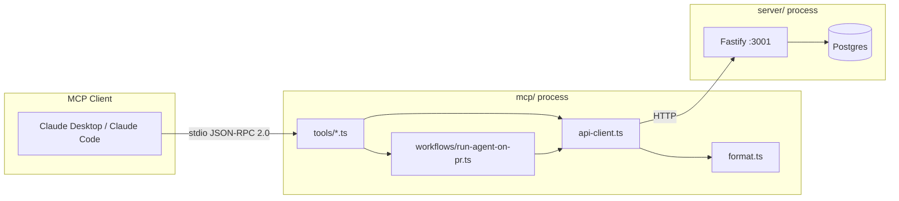

# @devdigest/mcp

A local **stdio MCP server** that exposes five DevDigest review tools to Claude Desktop and Claude Code. It runs as a subprocess communicating over stdin/stdout using the Model Context Protocol (JSON-RPC 2.0). It wraps the DevDigest REST API at `http://localhost:3001` — no database access, no authentication layer, local use only.

---

## What it is

This package is a thin transport adapter between an MCP client (Claude Desktop, Claude Code) and the existing DevDigest Fastify API. When an MCP client invokes a tool, the server:

1. Validates the input via a Zod schema.
2. Makes one or more HTTP calls to `http://localhost:3001` via `api-client.ts`.
3. Projects the response into a token-efficient shape and returns a `CallToolResult`.

All communication with the MCP client happens over **stdio** (stdin/stdout). There is no HTTP endpoint exposed by this server. There is no auth — it inherits whatever workspace the running DevDigest instance uses.



---

## Prerequisites

1. **DevDigest API must be running on `:3001`.**

   ```sh
   cd server && pnpm dev
   ```

2. **Seed the database** so `get_conventions` and `get_blast_radius` have data. Blast radius is pre-computed seed data only in L01 — live PRs return `available: false` without it.

   ```sh
   cd server && pnpm db:seed
   ```

   `pnpm db:seed` is idempotent; running it multiple times is safe.

---

## Quick start

Install dependencies once after cloning the repo, or whenever `mcp/package.json`
or `mcp/pnpm-lock.yaml` changes:

```sh
cd mcp
pnpm install
```

After that, the normal local start command is:

```sh
cd mcp
pnpm dev
```

`pnpm dev` runs `tsx src/index.ts`. The server emits a startup log on **stderr** and then waits for MCP messages on **stdin**. Nothing appears on stdout until an MCP client connects.

`DEVDIGEST_API_URL` defaults to `http://localhost:3001`, so it only needs to be
set explicitly when the DevDigest API runs somewhere else:

```sh
DEVDIGEST_API_URL=http://localhost:3001 pnpm dev
```

### Environment variables

| Variable | Default | Description |
|---|---|---|
| `DEVDIGEST_API_URL` | `http://localhost:3001` | Base URL of the running DevDigest Fastify API |

Copy `.env.example` to `.env` if the API runs on a non-default port.

---

## Claude Desktop config

Add the following entry to `claude_desktop_config.json` (usually at `~/Library/Application Support/Claude/claude_desktop_config.json` on macOS or `%APPDATA%\Claude\claude_desktop_config.json` on Windows):

```json
{
  "mcpServers": {
    "devdigest": {
      "command": "tsx",
      "args": ["/absolute/path/to/mcp/src/index.ts"],
      "env": { "DEVDIGEST_API_URL": "http://localhost:3001" }
    }
  }
}
```

The path in `args` must be an **absolute** path to `mcp/src/index.ts` on the local machine. `tsx` must be resolvable — it is installed as a dev dependency inside `mcp/` (`mcp/node_modules/.bin/tsx`), so either use the full path to the local binary or ensure `tsx` is on your `PATH` (e.g. via `npm install -g tsx` or using your shell's PATH configuration).

Example with a local `tsx` binary (no global install required):

```json
{
  "mcpServers": {
    "devdigest": {
      "command": "/absolute/path/to/mcp/node_modules/.bin/tsx",
      "args": ["/absolute/path/to/mcp/src/index.ts"],
      "env": { "DEVDIGEST_API_URL": "http://localhost:3001" }
    }
  }
}
```

There is no build step. `tsx` compiles TypeScript on the fly.

---

## Claude Code config

Place a `.mcp.json` at the **repo root** (or wherever Claude Code is invoked from). See `mcp/.claude/mcp.json.example` for a copy-paste template. The file must contain an absolute path — replace `<repo>` with the real path on your machine:

```json
{
  "mcpServers": {
    "devdigest": {
      "command": "tsx",
      "args": ["/absolute/path/to/mcp/src/index.ts"],
      "env": { "DEVDIGEST_API_URL": "http://localhost:3001" }
    }
  }
}
```

`.mcp.json` is session-local and should be added to `.gitignore` so hardcoded machine paths are not committed.

> **Windows tip.** Spawning `tsx.cmd` directly can fail in a no-shell spawner. The most robust command is `node` invoking the local `tsx` CLI:
> ```json
> "command": "node",
> "args": ["<repo>/mcp/node_modules/tsx/dist/cli.mjs", "<repo>/mcp/src/index.ts"]
> ```

---

## Enabling / disabling the server (token economy)

A project-scoped `.mcp.json` makes Claude Code **spawn this server at every session start** in this repo and inject the 5 tool definitions into context. The overhead is modest but non-zero, so disable the server on sessions that don't involve PR review, and enable it when you do.

**Toggle via `.claude/settings.local.json`.** Claude Code validates settings against a **strict schema** — `//` comments and unknown/duplicate keys are rejected and will break the whole file. So don't "comment a line"; flip the value of one valid key instead:

Disabled (token-saving) — the server does **not** start:

```json
{ "disabledMcpjsonServers": ["devdigest"] }
```

Enabled — empty the array:

```json
{ "disabledMcpjsonServers": [] }
```

(Add this key alongside your existing settings; don't replace the file.) Changes take effect on the **next** Claude Code start — MCP servers load at startup.

**Alternative — rename the config file** (no settings edit needed):

```sh
mv .mcp.json .mcp.json.off   # disable
mv .mcp.json.off .mcp.json   # enable
```

Check current server status any time with the `/mcp` command inside Claude Code.

---

## Using the tools (Claude Code terminal & Claude Desktop)

Once the server is configured and connected (see the config sections above — **restart the client** after editing `.mcp.json` or `claude_desktop_config.json`), the five tools become available to the model. You don't call them by name; you ask in natural language and the model picks the tool.

**Prerequisites for a real run:** the DevDigest API on `:3001` must be running and seeded. `run_agent_on_pr` additionally needs an LLM key (e.g. `OPENROUTER_API_KEY`) in `server/.env`.

### Verify the connection

- **Claude Code (terminal):** run `/mcp` — `devdigest` should show as connected with 5 tools. In Claude Code the tools are namespaced as `mcp__devdigest__list_agents`, `mcp__devdigest__run_agent_on_pr`, etc.
- **Claude Desktop:** open a chat and check the tools/plug icon — `devdigest` and its 5 tools should be listed. Server logs appear in the MCP log pane (developer menu).

### Example prompts

Type these in the Claude Code terminal or a Claude Desktop chat — the model resolves the right tool:

| You type | Tool invoked |
|---|---|
| "List the DevDigest review agents" | `list_agents` |
| "Show the conventions for repo `<repo_id>`" | `get_conventions` |
| "What's the review verdict for PR `<pr_id>`?" | `get_findings` (concise) |
| "Show the detailed findings for PR `<pr_id>`" | `get_findings` (detailed) |
| "Run the Security Reviewer on PR `<pr_id>` in repo `<repo_id>`" | `run_agent_on_pr` |
| "What's the blast radius of PR `<pr_id>`?" | `get_blast_radius` |

### Typical end-to-end workflow

1. **Get a valid agent id** — "List the DevDigest agents" → copy the `id` of the agent you want (e.g. Security Reviewer). This is what `list_agents` is for.
2. **Get the repo / PR ids** — the tools use internal UUIDs, not GitHub PR numbers. Query the API: `curl http://localhost:3001/repos` for `repo_id`, then `curl http://localhost:3001/repos/<repo_id>/pulls` for `pr_id` (match by `number`/`title`).
3. **Run the review** — "Run agent `<agent_id>` on PR `<pr_id>` in repo `<repo_id>`". `run_agent_on_pr` blocks up to 120 s and returns verdict, score, findings breakdown, and top findings.
4. **Re-read later without re-running** — "Show findings for PR `<pr_id>` in detail" → `get_findings`.

`run_agent_on_pr` is the only tool that writes (it starts a review); the other four are read-only.

---

## Testing with MCP Inspector

[MCP Inspector](https://github.com/modelcontextprotocol/inspector) is the official browser-based GUI for exercising any MCP server by hand — the quickest way to verify all five tools end-to-end without wiring a Claude client.

**Launch** (from `mcp/`, with the DevDigest API running on `:3001` and seeded):

```sh
cd mcp
cp .env.example .env        # once — --env-file reads it
pnpm inspector              # = npx @modelcontextprotocol/inspector tsx --env-file=.env src/index.ts
```

The Inspector opens in your browser with Transport `STDIO`, Command `tsx`, and Args `--env-file=.env src/index.ts` pre-filled.

**Steps:**

1. **Connect** — click **Connect**. The status turns green (**Connected**).
2. **List Tools** — click **List Tools**. All five appear: `list_agents`, `run_agent_on_pr`, `get_findings`, `get_conventions`, `get_blast_radius`.
3. **`list_agents`** — no parameters; click **Run Tool**. Copy any agent `id` — you'll need it next.
4. **`run_agent_on_pr`** — needs three UUIDs: `agent_id` (from step 3), plus `pr_id` and `repo_id` (see *Finding the IDs* below). Click **Run Tool**. This **blocks up to 120 s** (it starts a real review and polls) and requires an LLM key (`OPENROUTER_API_KEY`) in `server/.env`.
5. **`get_findings`** — paste the same `pr_id`; run to read the verdict/findings without re-running.
6. **`get_conventions`** — paste a `repo_id`; run to see the repo's accepted/verified conventions.
7. **`get_blast_radius`** — paste a `pr_id`; returns `{ available: false }` unless the PR has pre-computed seed data.

### Finding the IDs

- **`repo_id`** — open DevDigest in the browser and go to a repository; the UUID after `/repos/` in the URL is the `repo_id`.
- **`pr_id`** — the tools use the internal UUID, **not** the GitHub PR number. Either:
  - **Network tab:** open a PR in DevDigest → DevTools → **Network** → find the request ending in `/pulls` → in the response, locate the PR by `title`/`number` and copy its `id`; or
  - **curl:** `curl http://localhost:3001/repos/<repo_id>/pulls` and match by `title`/`number`.
- **`agent_id`** — from `list_agents` (step 3), or `curl http://localhost:3001/agents`.

---

## Tool reference

| Tool | Arguments | Returns | Read-only |
|---|---|---|---|
| `list_agents` | (none) | List of agents: `id`, `name`, `description`, `provider`, `model`, `enabled` | yes |
| `run_agent_on_pr` | `repo_id` (UUID), `pr_id` (UUID), `agent_id` (UUID) | Completed run: verdict, score, findings breakdown, top findings (up to 10). Blocks up to 120 s. | no |
| `get_findings` | `pr_id` (UUID), `response_format` (`concise`\|`detailed`, default `concise`), `limit` (int 1–50, default 20) | Concise: per-agent verdict + score + findings breakdown. Detailed: adds finding bodies, paginated. | yes |
| `get_conventions` | `repo_id` (UUID) | Accepted/verified repo conventions: `rule`, `category`, `status`, `evidence_path` | yes |
| `get_blast_radius` | `pr_id` (UUID) | PR blast radius (seed data only); `{ available: false }` for live PRs without pre-computed data | yes |

### Tool details

**`list_agents`**
Lists the review agents configured in this DevDigest workspace. Call this first to obtain a valid `agent_id` before calling `run_agent_on_pr`. Disabled agents are included in the response so you can see the full configuration.

**`run_agent_on_pr`**
Runs one review agent on a pull request. Validates that `pr_id` belongs to `repo_id`, posts a new review, polls until the run status is `done` or `error` (every 2 s), then returns the completed result. Blocks for up to 120 s; returns an actionable timeout message if the run does not finish in time. To read an existing review without triggering a new run, use `get_findings` instead.

**`get_findings`**
Returns reviews already completed for a PR without starting a new run. `concise` mode (default) returns one summary row per agent; `detailed` mode adds the finding bodies, up to `limit` findings total across all agents.

**`get_conventions`**
Returns evidence-backed coding conventions mined from the codebase. Only `accepted` and `verified` conventions are returned; `pending` and `rejected` candidates are omitted. Useful for understanding a repository's house style before reasoning about a review.

**`get_blast_radius`**
Returns which symbols a PR changes, what downstream code depends on them, and which endpoints are affected. Backed by pre-computed seed data in L01. For any live PR that has no pre-computed blast radius the tool returns `{ available: false, reason: "..." }` — it never fabricates an answer.

---

## Logs

All log output goes to **stderr only**. Stdout is reserved for the MCP stdio protocol (JSON-RPC 2.0 framing); writing anything to stdout other than protocol messages corrupts the channel.

In Claude Desktop, logs from this server appear in the **MCP log pane** (accessible from the developer menu). When running `pnpm dev` directly in a terminal, stderr output appears in that terminal session.
