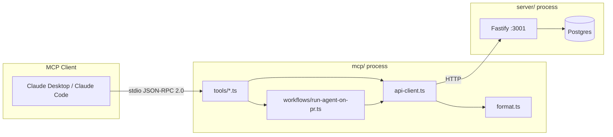

# @devdigest/mcp

A local **stdio MCP server** that exposes five DevDigest review tools to Claude Desktop and Claude Code. It runs as a subprocess communicating over stdin/stdout using the Model Context Protocol (JSON-RPC 2.0). It wraps the DevDigest REST API at `http://localhost:3001` — no database access, no authentication layer, local use only.

---

## What it is

This package is a thin transport adapter between an MCP client (Claude Desktop, Claude Code) and the existing DevDigest Fastify API. When an MCP client invokes a tool, the server:

1. Validates the input via a Zod schema.
2. Makes one or more HTTP calls to `http://localhost:3001` via `api-client.ts`.
3. Projects the response into a token-efficient shape and returns a `CallToolResult`.

All communication with the MCP client happens over **stdio** (stdin/stdout). There is no HTTP endpoint exposed by this server. There is no auth — it inherits whatever workspace the running DevDigest instance uses.



---

## Prerequisites

1. **DevDigest API must be running on `:3001`.**

   ```sh
   cd server && pnpm dev
   ```

2. **Seed the database** so `get_conventions` and `get_blast_radius` have data. Blast radius is pre-computed seed data only in L01 — live PRs return `available: false` without it.

   ```sh
   cd server && pnpm db:seed
   ```

   `pnpm db:seed` is idempotent; running it multiple times is safe.

---

## Quick start

```sh
cd mcp
pnpm install
DEVDIGEST_API_URL=http://localhost:3001 pnpm dev
```

`pnpm dev` runs `tsx src/index.ts`. The server emits a startup log on **stderr** and then waits for MCP messages on **stdin**. Nothing appears on stdout until an MCP client connects.

### Environment variables

| Variable | Default | Description |
|---|---|---|
| `DEVDIGEST_API_URL` | `http://localhost:3001` | Base URL of the running DevDigest Fastify API |

Copy `.env.example` to `.env` if the API runs on a non-default port.

---

## Claude Desktop config

Add the following entry to `claude_desktop_config.json` (usually at `~/Library/Application Support/Claude/claude_desktop_config.json` on macOS or `%APPDATA%\Claude\claude_desktop_config.json` on Windows):

```json
{
  "mcpServers": {
    "devdigest": {
      "command": "tsx",
      "args": ["/absolute/path/to/mcp/src/index.ts"],
      "env": { "DEVDIGEST_API_URL": "http://localhost:3001" }
    }
  }
}
```

The path in `args` must be an **absolute** path to `mcp/src/index.ts` on the local machine. `tsx` must be resolvable — it is installed as a dev dependency inside `mcp/` (`mcp/node_modules/.bin/tsx`), so either use the full path to the local binary or ensure `tsx` is on your `PATH` (e.g. via `npm install -g tsx` or using your shell's PATH configuration).

Example with a local `tsx` binary (no global install required):

```json
{
  "mcpServers": {
    "devdigest": {
      "command": "/absolute/path/to/mcp/node_modules/.bin/tsx",
      "args": ["/absolute/path/to/mcp/src/index.ts"],
      "env": { "DEVDIGEST_API_URL": "http://localhost:3001" }
    }
  }
}
```

There is no build step. `tsx` compiles TypeScript on the fly.

---

## Claude Code config

Place a `.mcp.json` at the **repo root** (or wherever Claude Code is invoked from). See `mcp/.claude/mcp.json.example` for a copy-paste template. The file must contain an absolute path — replace `<repo>` with the real path on your machine:

```json
{
  "mcpServers": {
    "devdigest": {
      "command": "tsx",
      "args": ["/absolute/path/to/mcp/src/index.ts"],
      "env": { "DEVDIGEST_API_URL": "http://localhost:3001" }
    }
  }
}
```

`.mcp.json` is session-local and should be added to `.gitignore` so hardcoded machine paths are not committed.

---

## Tool reference

| Tool | Arguments | Returns | Read-only |
|---|---|---|---|
| `list_agents` | (none) | List of agents: `id`, `name`, `description`, `provider`, `model`, `enabled` | yes |
| `run_agent_on_pr` | `repo_id` (UUID), `pr_id` (UUID), `agent_id` (UUID) | Completed run: verdict, score, findings breakdown, top findings (up to 10). Blocks up to 120 s. | no |
| `get_findings` | `pr_id` (UUID), `response_format` (`concise`\|`detailed`, default `concise`), `limit` (int 1–50, default 20) | Concise: per-agent verdict + score + findings breakdown. Detailed: adds finding bodies, paginated. | yes |
| `get_conventions` | `repo_id` (UUID) | Accepted/verified repo conventions: `rule`, `category`, `status`, `evidence_path` | yes |
| `get_blast_radius` | `pr_id` (UUID) | PR blast radius (seed data only); `{ available: false }` for live PRs without pre-computed data | yes |

### Tool details

**`list_agents`**
Lists the review agents configured in this DevDigest workspace. Call this first to obtain a valid `agent_id` before calling `run_agent_on_pr`. Disabled agents are included in the response so you can see the full configuration.

**`run_agent_on_pr`**
Runs one review agent on a pull request. Validates that `pr_id` belongs to `repo_id`, posts a new review, polls until the run status is `done` or `error` (every 2 s), then returns the completed result. Blocks for up to 120 s; returns an actionable timeout message if the run does not finish in time. To read an existing review without triggering a new run, use `get_findings` instead.

**`get_findings`**
Returns reviews already completed for a PR without starting a new run. `concise` mode (default) returns one summary row per agent; `detailed` mode adds the finding bodies, up to `limit` findings total across all agents.

**`get_conventions`**
Returns evidence-backed coding conventions mined from the codebase. Only `accepted` and `verified` conventions are returned; `pending` and `rejected` candidates are omitted. Useful for understanding a repository's house style before reasoning about a review.

**`get_blast_radius`**
Returns which symbols a PR changes, what downstream code depends on them, and which endpoints are affected. Backed by pre-computed seed data in L01. For any live PR that has no pre-computed blast radius the tool returns `{ available: false, reason: "..." }` — it never fabricates an answer.

---

## Logs

All log output goes to **stderr only**. Stdout is reserved for the MCP stdio protocol (JSON-RPC 2.0 framing); writing anything to stdout other than protocol messages corrupts the channel.

In Claude Desktop, logs from this server appear in the **MCP log pane** (accessible from the developer menu). When running `pnpm dev` directly in a terminal, stderr output appears in that terminal session.
