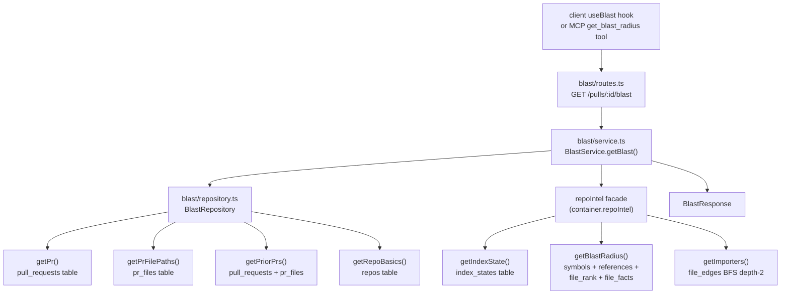

# `blast` — blast radius for a PR

`blast` answers the first question of any reviewer: *"what can these changes break?"* It maps PR-changed files to the symbols declared in them, finds every cross-file caller of those symbols, and attributes reachable HTTP endpoints and cron jobs — all from the precomputed `repo-intel` index. There are **zero LLM calls**; the summary string is generated deterministically.

The module is a standard onion layer: `routes.ts` → `service.ts` → `repository.ts`, registered in `modules/index.ts`. It never reads `symbols`, `references`, `file_edges`, or `file_rank` tables directly; every index read is delegated to the `repoIntel` facade.

## Endpoint

### `GET /pulls/:id/blast`

Returns `BlastResponse` for a pull request. Workspace is resolved from the request context via `getContext`; a PR that does not belong to the caller's workspace returns `404`.

**Response schema** — `BlastResponse` (`server/src/vendor/shared/contracts/blast.ts`):

| Field | Type | Semantics |
|---|---|---|
| `available` | `boolean` | `false` when `blast` is `null` (no symbols found and no callers); renders empty state |
| `blast` | `BlastRadius \| null` | Changed symbols + per-symbol downstream impacts + deterministic summary string; `null` when `available` is `false` |
| `blast.changed_symbols` | `ChangedSymbol[]` | Symbols declared in the PR's changed files (`name`, `file`, `kind`) |
| `blast.downstream` | `DownstreamImpact[]` | One entry per changed symbol **with ≥1 caller** (zero-caller symbols are excluded from the tree; `changed_symbols` still lists them all) — callers capped at 20, `endpoints_affected`, `crons_affected` |
| `blast.summary` | `string` | Deterministic sentence: `"N symbols changed · N callers · N endpoints · N crons reachable"` |
| `history` | `PrHistory` | Up to 5 prior PRs in the same repo that touched the same files, ordered by `updated_at DESC` |
| `index` | `BlastIndexInfo` | Index health: `status` (`full` / `partial` / `degraded` / `failed`), `degraded` flag, optional `reason` |
| `link` | `BlastLink \| null` | `{ owner, repo, head_sha }` — everything the client needs to build GitHub blob URLs; `null` when the repo row lacks `owner`/`name` |
| `truncated` | `Record<string, number>` (optional) | Maps symbol name → number of callers hidden by the 20-per-symbol cap; absent when nothing was truncated |

`BlastRadius`, `DownstreamImpact`, `PrHistory`, and `PrHistoryItem` are defined in `contracts/brief.ts` and reused here so the card component works with both live data and seed brief data through the same rendering path.

`BlastIndexInfo` and `BlastLink` are defined in `contracts/blast.ts`.

## Data flow

## Assembly order in `BlastService.getBlast()`

1. `getPr(workspaceId, prId)` — 404 when absent or cross-workspace.
2. `getPrFilePaths(workspaceId, prId)` — paths from `pr_files`, scoped via inner join.
3. `repoIntel.getIndexState(repoId)` — sets `index.status / degraded / reason`.
4. `repoIntel.getBlastRadius(repoId, changedFiles)` — symbols, callers (rank-sorted, cross-file only, resolved `decl_file` on the persistent path), and `factsByFile` (endpoint/cron facts per caller file, present on the persistent path only).
5. Group callers by `viaSymbol`; clamp to **20 per symbol**; record hidden counts in `truncated`.
6. `repoIntel.getImporters(repoId, changedFiles, 2)` — level-2 reverse import BFS to discover files that transitively import the changed files; their endpoint facts (if found in `factsByFile`) are unioned into the first symbol's attribution.
7. Build `downstream`: per-symbol endpoint/cron attribution from `factsByFile` over caller files + reachable files (first symbol only for level-2 entries).
8. Construct deterministic `summary` string.
9. `getPriorPrs(workspaceId, repoId, changedFiles, prId)` — up to 5 prior PRs with overlapping paths.
10. `getRepoBasics(repoId)` — `owner` and `name` for `link`.
11. `available = blast !== null` (true when at least one changed symbol or one caller exists).

## Degraded semantics

The index may be unavailable or partially built. The response communicates this honestly rather than silently returning an empty card.

| Condition | `index.status` | `index.degraded` | `index.reason` | `available` |
|---|---|---|---|---|
| Full persistent index | `"full"` | `false` | null | true when symbols exist |
| Partial index (some files indexed) | `"partial"` | `false` | null | true when symbols exist |
| Ripgrep fallback active | `"degraded"` | `true` | e.g. `"no_data"` | true when symbols exist |
| No usable index and no callers | `"degraded"` | `true` | set | `false` |
| No changed files in PR | any | any | any | `false` |

When `available` is `false`, `blast` is `null`. The client renders an empty state (not a blank card). When `index.degraded` is `true` or `index.status` is `"partial"`, the `BlastRadiusCard` shows a warning badge with `index.reason` as its tooltip.

On the degraded/ripgrep path `factsByFile` is absent; endpoint attribution falls back to `blastResult.impactedEndpoints` assigned to the first changed symbol only.

## Documented caveats

**`merged_at` uses `updatedAt` as a proxy.** The `pull_requests` schema has no `merged_at` column. `BlastRepository.getPriorPrs()` uses `updatedAt` as the closest available timestamp and maps it to `PrHistoryItem.merged_at`. Rows with no `updatedAt` fall back to `new Date(0).toISOString()`.

**Level-2 endpoint attribution is limited.** The `repoIntel` facade has no `getFileFacts(repoId, files)` method that accepts an arbitrary file list. Level-2 reachable files (discovered via `getImporters`) are only attributed endpoints if those files already appear in the `factsByFile` map that `getBlastRadius` built from direct caller files. A future facade extension would expose a direct `getFileFacts` call to close this gap. This limitation is noted in the comment near `reachable` in `service.ts`.

**Zero-caller symbols are excluded from `downstream`.** A changed symbol nobody calls has no downstream impact to show, so it gets no tree entry (design rule). It still counts in `changed_symbols`. Level-2/degraded endpoint attribution goes to the first symbol *with callers*, so filtered symbols never swallow endpoints.

**20-callers-per-symbol cap with `truncated`.** The facade's `tryPersistentBlast` globally caps callers; `BlastService` re-clamps to 20 per symbol and writes hidden counts to `truncated`. The client renders a `"+N more"` row per symbol from this map.

**Graph node cap at 60.** `BlastGraph.tsx` renders at most 60 nodes total; when total node count exceeds this, caller-file nodes are proportionally truncated and a single muted `"+N more"` summary node is added to the graph.

## Client components

| File | Purpose |
|---|---|
| `client/src/lib/hooks/blast.ts` | `useBlast(prId)` — TanStack Query hook, `staleTime: 5 min` |
| `OverviewTab/BlastRadiusCard.tsx` | Card shell — stats row, Tree/Graph toggle, degraded badge, prior-PRs accordion |
| `OverviewTab/SymbolImpact.tsx` | Per-symbol accordion — clickable `file:line` anchors when `link` present, endpoint/cron badges |
| `OverviewTab/BlastGraph.tsx` | React Flow graph view — 3-column layout (symbols | callers | endpoints/crons); dynamic-imported with `ssr: false` |

GitHub blob URL format constructed by `SymbolImpact` and `BlastGraph`:
`https://github.com/{owner}/{repo}/blob/{head_sha}/{file}#L{line}`

## See also

- [`repo-intel/README.md`](../repo-intel/README.md) — facade methods this module reads through
- [`server/src/vendor/shared/contracts/blast.ts`](../../vendor/shared/contracts/blast.ts) — `BlastResponse`, `BlastIndexInfo`, `BlastLink`
- [`server/src/vendor/shared/contracts/brief.ts`](../../vendor/shared/contracts/brief.ts) — `BlastRadius`, `DownstreamImpact`, `PrHistory`
